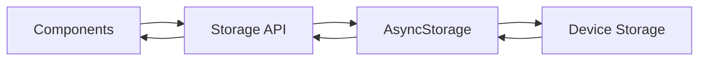

## Introduction

The Storage API provides a comprehensive set of functions for managing all persistent data in the Rippler workout tracker. Built on top of React Native's AsyncStorage, it handles exercises, logged workouts, target overrides, goal weights, and program progression.

## Architecture

All storage operations are asynchronous and handle errors gracefully, returning default values when data retrieval fails. The API uses a centralized key management system to ensure consistent data access across the application.

### Storage Keys

The following AsyncStorage keys are used throughout the application:

<ResponseField name="@rippler/exercises" type="string">
  Stores the array of user exercises with their IDs, names, and optional notes
</ResponseField>

<ResponseField name="@rippler/logged_workouts" type="string">
  Contains all completed workout sessions with exercise logs and timestamps
</ResponseField>

<ResponseField name="@rippler/current_week" type="string">
  Tracks the user's current week in the Rippler program (1-16)
</ResponseField>

<ResponseField name="@rippler/target_overrides" type="string">
  Stores custom weight/rep/set targets that override program defaults
</ResponseField>

<ResponseField name="@rippler/goal_weights" type="string">
  Maps exercise names to user-defined goal weights
</ResponseField>

## Data Flow



## Core Functionality

The Storage API is organized into five main categories:

### Exercise Management

Create, read, update, and delete exercises from your workout library. Each exercise has a unique ID, name, and optional notes.

[Learn more →](/api/storage/exercises)

### Workout Logging

Persist completed workouts with detailed set-by-set tracking, including weights, reps, and completion status for each exercise.

[Learn more →](/api/storage/workouts)

### Goal Setting

Define and track target weights for each exercise to measure progress throughout the program.

[Learn more →](/api/storage/goals)

### Target Overrides

Customize specific workout targets for any day in the program, allowing flexibility while maintaining structure.

[Learn more →](/api/storage/overrides)

## Error Handling

All storage functions implement try-catch error handling:

```typescript
try {
  const data = await AsyncStorage.getItem(key);
  return data ? JSON.parse(data) : defaultValue;
} catch (error) {
  console.error('Error message:', error);
  return defaultValue;
}
```

<Warning>
  All storage operations fail silently and return safe defaults. Monitor console logs during development to catch storage issues.
</Warning>

## Data Types

The Storage API works with these core TypeScript types:

<CodeGroup>

```typescript Exercise
export interface Exercise {
  id: string;
  name: string;
  notes?: string;
}
```

```typescript LoggedWorkout
export interface LoggedWorkout {
  id: string;
  week: number;
  day: string;
  dateLogged: string;
  exercises: LoggedExercise[];
  completed: boolean;
}
```

```typescript TargetOverride
export interface TargetOverride {
  week: number;
  day: string;
  exerciseIndex: number;
  weight?: number | string;
  reps?: number | string;
  sets?: number | string;
}
```

</CodeGroup>

## Best Practices

<AccordionGroup>
  <Accordion title="Always await storage operations">
    Storage functions are asynchronous. Always use `await` or `.then()` to ensure data is persisted before proceeding.
    
    ```typescript
    // Good
    await saveExercises(exercises);
    console.log('Saved!');
    
    // Bad - save might not complete
    saveExercises(exercises);
    console.log('Saved!');
    ```
  </Accordion>

  <Accordion title="Use getter functions for defaults">
    Getter functions like `getExercises()` automatically initialize data with sensible defaults if nothing exists.
    
    ```typescript
    // Automatically gets defaults if no exercises exist
    const exercises = await getExercises();
    ```
  </Accordion>

  <Accordion title="Batch updates when possible">
    For multiple changes, modify the array in memory and save once rather than saving after each change.
    
    ```typescript
    // Good - single save
    const exercises = await getExercises();
    exercises.push(newExercise1);
    exercises.push(newExercise2);
    await saveExercises(exercises);
    
    // Bad - multiple saves
    await addExercise('Exercise 1');
    await addExercise('Exercise 2');
    ```
  </Accordion>
</AccordionGroup>

## Import

```typescript
import {
  getExercises,
  saveLoggedWorkout,
  setGoalWeight,
  saveTargetOverride,
  getCurrentWeek
} from '@/lib/storage';
```

## Next Steps

<CardGroup cols={2}>
  <Card title="Exercise Storage" icon="dumbbell" href="/api/storage/exercises">
    Manage your exercise library
  </Card>
  <Card title="Workout Storage" icon="clipboard-list" href="/api/storage/workouts">
    Log and retrieve workout sessions
  </Card>
  <Card title="Goal Storage" icon="bullseye" href="/api/storage/goals">
    Set and track goal weights
  </Card>
  <Card title="Override Storage" icon="sliders" href="/api/storage/overrides">
    Customize workout targets
  </Card>
</CardGroup>