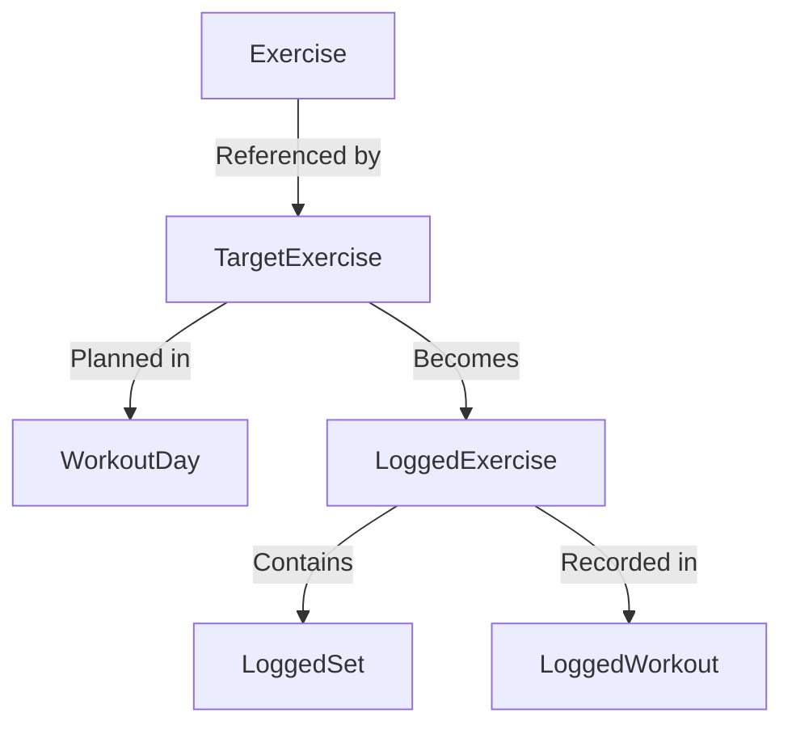

## Overview

The exercise types define how exercises are structured, planned, and tracked in the Rippler app. These types cover everything from basic exercise definitions to detailed set-by-set logging.

## Exercise

Base interface for exercise definitions.

```typescript
export interface Exercise {
  id: string;
  name: string;
  notes?: string;
}
```

<ParamField path="id" type="string" required>
  Unique identifier for the exercise
</ParamField>

<ParamField path="name" type="string" required>
  Display name of the exercise (e.g., "Squat", "Bench Press", "Deadlift")
</ParamField>

<ParamField path="notes" type="string">
  Optional notes about the exercise, such as form cues, variations, or equipment requirements
</ParamField>

### Usage

The Exercise interface represents the base definition of a movement in your exercise library. It's used to maintain a catalog of all available exercises in the app.

---

## TargetExercise

Defines prescribed training targets for an exercise in a planned workout.

```typescript
export interface TargetExercise {
  tier: Tier;
  exercise: string;
  weight: number | string;
  reps: number | string;
  sets: number | string;
}
```

<ParamField path="tier" type="Tier" required>
  Training tier classification. See [Tier](/api/types/tier) for available values (T1, T2, T3a, T3b).
</ParamField>

<ParamField path="exercise" type="string" required>
  Name or identifier of the exercise to perform
</ParamField>

<ParamField path="weight" type="number | string" required>
  Target weight to lift. Can be a number (in lbs/kg) or string for special cases like "BW" (bodyweight), "BW+45", etc.
</ParamField>

<ParamField path="reps" type="number | string" required>
  Target repetitions per set. Can be a number or string like "AMRAP" (as many reps as possible), "5-8", etc.
</ParamField>

<ParamField path="sets" type="number | string" required>
  Target number of sets. Can be a number or string for special protocols
</ParamField>

### Usage

TargetExercise defines what you're supposed to do in a planned workout. It's used in WorkoutDay to prescribe training targets.

<Info>
The flexible `number | string` types allow for both precise numeric targets and qualitative descriptors common in strength training programs.
</Info>

---

## LoggedExercise

Records actual performance data for an exercise in a completed workout.

```typescript
export interface LoggedExercise {
  tier: Tier;
  exercise: string;
  sets: LoggedSet[];
  notes?: string;
}
```

<ParamField path="tier" type="Tier" required>
  The tier classification for this exercise. See [Tier](/api/types/tier).
</ParamField>

<ParamField path="exercise" type="string" required>
  Name or identifier of the exercise that was performed
</ParamField>

<ParamField path="sets" type="LoggedSet[]" required>
  Array of individual set performances. See [LoggedSet](#loggedset) below for details.
</ParamField>

<ParamField path="notes" type="string">
  Optional notes recorded during or after the exercise (e.g., "felt heavy", "easy", form feedback)
</ParamField>

### Usage

LoggedExercise captures your actual workout performance, enabling progress tracking and analysis. Unlike TargetExercise, this contains detailed set-by-set data.

---

## LoggedSet

Records performance data for a single set within an exercise.

```typescript
export interface LoggedSet {
  setNumber: number;
  weight: number | string;
  reps: number | string;
  completed: boolean;
}
```

<ParamField path="setNumber" type="number" required>
  The set number in sequence (1, 2, 3, etc.)
</ParamField>

<ParamField path="weight" type="number | string" required>
  Actual weight lifted. Can be numeric or string for bodyweight variations
</ParamField>

<ParamField path="reps" type="number | string" required>
  Actual repetitions completed. Can be numeric or string descriptors
</ParamField>

<ParamField path="completed" type="boolean" required>
  Whether this set was successfully completed
</ParamField>

### Usage

LoggedSet provides granular tracking of each individual set, allowing detailed analysis of workout performance.

<Tip>
The `completed` flag helps distinguish between sets that were attempted vs. skipped, which is useful for tracking fatigue or identifying failed sets.
</Tip>

---

## Type Relationships



<Card title="Planning vs. Logging" icon="dumbbell">
  **TargetExercise** defines what you plan to do, while **LoggedExercise** records what you actually did. This separation allows you to compare prescribed vs. actual performance.
</Card>
