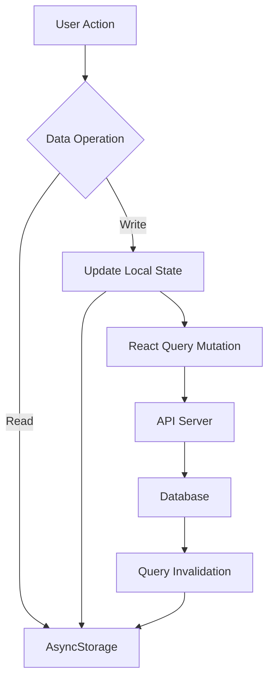

## Data Flow Overview

Rippler implements a **hybrid data architecture** combining local-first storage with server synchronization:



<Note>
All data is first persisted locally via AsyncStorage, then synchronized with the server when available. This ensures the app works offline and provides instant feedback.
</Note>

## Local Storage Layer

### AsyncStorage Implementation

The storage layer is abstracted in `client/lib/storage.ts` with typed functions for each data entity:

```ts client/lib/storage.ts:5-11
const KEYS = {
  EXERCISES: "@rippler/exercises",
  LOGGED_WORKOUTS: "@rippler/logged_workouts",
  CURRENT_WEEK: "@rippler/current_week",
  TARGET_OVERRIDES: "@rippler/target_overrides",
  GOAL_WEIGHTS: "@rippler/goal_weights",
};
```

### Storage Patterns

<Tabs>
  <Tab title="Read Pattern">
    Reading data with fallback to defaults:
    
    ```ts client/lib/storage.ts:13-31
    export async function getExercises(): Promise<Exercise[]> {
      try {
        const data = await AsyncStorage.getItem(KEYS.EXERCISES);
        if (data) {
          return JSON.parse(data);
        }
        // Initialize with default exercises from program
        const defaultExercises: Exercise[] = ripplerProgram.exercises.map(
          (name, index) => ({
            id: `ex_${index}`,
            name,
          })
        );
        await AsyncStorage.setItem(KEYS.EXERCISES, JSON.stringify(defaultExercises));
        return defaultExercises;
      } catch (error) {
        console.error("Error getting exercises:", error);
        return [];
      }
    }
    ```
    
    <Warning>
    Always wrap AsyncStorage calls in try/catch blocks. Network errors or storage quota issues can throw exceptions.
    </Warning>
  </Tab>
  
  <Tab title="Write Pattern">
    Writing data with error handling:
    
    ```ts client/lib/storage.ts:33-39
    export async function saveExercises(exercises: Exercise[]): Promise<void> {
      try {
        await AsyncStorage.setItem(KEYS.EXERCISES, JSON.stringify(exercises));
      } catch (error) {
        console.error("Error saving exercises:", error);
      }
    }
    ```
  </Tab>
  
  <Tab title="Update Pattern">
    Updating individual records:
    
    ```ts client/lib/storage.ts:53-63
    export async function updateExercise(
      id: string,
      updates: Partial<Exercise>
    ): Promise<void> {
      const exercises = await getExercises();
      const index = exercises.findIndex((e) => e.id === id);
      if (index !== -1) {
        exercises[index] = { ...exercises[index], ...updates };
        await saveExercises(exercises);
      }
    }
    ```
  </Tab>
  
  <Tab title="Delete Pattern">
    Deleting records:
    
    ```ts client/lib/storage.ts:65-69
    export async function deleteExercise(id: string): Promise<void> {
      const exercises = await getExercises();
      const filtered = exercises.filter((e) => e.id !== id);
      await saveExercises(filtered);
    }
    ```
  </Tab>
</Tabs>

## Data Entities

### Exercises

<ParamField path="id" type="string" required>
  Unique identifier (format: `ex_{timestamp}`)
</ParamField>
<ParamField path="name" type="string" required>
  Exercise name (e.g., "Squat", "Bench Press")
</ParamField>
<ParamField path="notes" type="string">
  Optional notes about form, technique, etc.
</ParamField>

```ts Example Usage
import { addExercise, getExercises, updateExercise } from '@/lib/storage';

// Add new exercise
const exercise = await addExercise("Romanian Deadlift", "Focus on hip hinge");

// Get all exercises
const exercises = await getExercises();

// Update exercise
await updateExercise(exercise.id, { notes: "Keep back neutral" });
```

### Logged Workouts

Workouts are stored with complete set-by-set data:

```ts client/lib/storage.ts:84-97
export async function saveLoggedWorkout(workout: LoggedWorkout): Promise<void> {
  try {
    const workouts = await getLoggedWorkouts();
    const existingIndex = workouts.findIndex((w) => w.id === workout.id);
    if (existingIndex !== -1) {
      workouts[existingIndex] = workout;
    } else {
      workouts.push(workout);
    }
    await AsyncStorage.setItem(KEYS.LOGGED_WORKOUTS, JSON.stringify(workouts));
  } catch (error) {
    console.error("Error saving logged workout:", error);
  }
}
```

<Accordion title="LoggedWorkout Type Definition">
```ts client/types/workout.ts:38-45
export interface LoggedWorkout {
  id: string;
  week: number;
  day: string;
  dateLogged: string;
  exercises: LoggedExercise[];
  completed: boolean;
}

export interface LoggedExercise {
  tier: Tier;
  exercise: string;
  sets: LoggedSet[];
  notes?: string;
}

export interface LoggedSet {
  setNumber: number;
  weight: number | string;
  reps: number | string;
  completed: boolean;
}
```
</Accordion>

### Current Week

Tracks progression through the program:

```ts client/lib/storage.ts:117-136
export async function getCurrentWeek(): Promise<number> {
  try {
    const data = await AsyncStorage.getItem(KEYS.CURRENT_WEEK);
    if (data) {
      return parseInt(data, 10);
    }
    return 1;
  } catch (error) {
    console.error("Error getting current week:", error);
    return 1;
  }
}

export async function setCurrentWeek(week: number): Promise<void> {
  try {
    await AsyncStorage.setItem(KEYS.CURRENT_WEEK, week.toString());
  } catch (error) {
    console.error("Error setting current week:", error);
  }
}
```

### Target Overrides

Allows users to customize prescribed weights/reps:

```ts client/lib/storage.ts:151-169
export async function saveTargetOverride(override: TargetOverride): Promise<void> {
  try {
    const overrides = await getTargetOverrides();
    const existingIndex = overrides.findIndex(
      (o) =>
        o.week === override.week &&
        o.day === override.day &&
        o.exerciseIndex === override.exerciseIndex
    );
    if (existingIndex !== -1) {
      overrides[existingIndex] = override;
    } else {
      overrides.push(override);
    }
    await AsyncStorage.setItem(KEYS.TARGET_OVERRIDES, JSON.stringify(overrides));
  } catch (error) {
    console.error("Error saving target override:", error);
  }
}
```

### Goal Weights

Stores user's target weights for each exercise:

```ts client/lib/storage.ts:220-227
export async function setGoalWeight(
  exerciseName: string,
  weight: number
): Promise<void> {
  const goals = await getGoalWeights();
  goals[exerciseName] = weight;
  await saveGoalWeights(goals);
}
```

## Server State Management

### React Query Configuration

React Query handles all server communication with opinionated defaults:

```ts client/lib/query-client.ts:66-79
export const queryClient = new QueryClient({
  defaultOptions: {
    queries: {
      queryFn: getQueryFn({ on401: "throw" }),
      refetchInterval: false,
      refetchOnWindowFocus: false,
      staleTime: Infinity,
      retry: false,
    },
    mutations: {
      retry: false,
    },
  },
});
```

<ResponseField name="refetchInterval" type="false">
  Manual refetching only - no automatic polling
</ResponseField>
<ResponseField name="refetchOnWindowFocus" type="false">
  Prevents refetching when app returns to foreground
</ResponseField>
<ResponseField name="staleTime" type="Infinity">
  Cached data never becomes stale automatically
</ResponseField>
<ResponseField name="retry" type="false">
  Failed requests don't retry (fail fast)
</ResponseField>

### API Request Helper

Centralized API request function with error handling:

```ts client/lib/query-client.ts:26-43
export async function apiRequest(
  method: string,
  route: string,
  data?: unknown | undefined,
): Promise<Response> {
  const baseUrl = getApiUrl();
  const url = new URL(route, baseUrl);

  const res = await fetch(url, {
    method,
    headers: data ? { "Content-Type": "application/json" } : {},
    body: data ? JSON.stringify(data) : undefined,
    credentials: "include",
  });

  await throwIfResNotOk(res);
  return res;
}
```

### Query Function Factory

Custom query function with 401 handling:

```ts client/lib/query-client.ts:46-64
export const getQueryFn: <T>(options: {
  on401: UnauthorizedBehavior;
}) => QueryFunction<T> =
  ({ on401: unauthorizedBehavior }) =>
  async ({ queryKey }) => {
    const baseUrl = getApiUrl();
    const url = new URL(queryKey.join("/") as string, baseUrl);

    const res = await fetch(url, {
      credentials: "include",
    });

    if (unauthorizedBehavior === "returnNull" && res.status === 401) {
      return null;
    }

    await throwIfResNotOk(res);
    return await res.json();
  };
```

## Data Flow Examples

### Example 1: Loading Exercises

<Steps>
  <Step title="Component Mounts">
    Screen component loads and needs exercise data
  </Step>
  <Step title="Read from AsyncStorage">
    Call `getExercises()` to retrieve local data
  </Step>
  <Step title="Return Cached Data">
    If data exists, return immediately (instant UI update)
  </Step>
  <Step title="Initialize Defaults">
    If no data, initialize from `rippler-program.ts` defaults
  </Step>
  <Step title="Save Defaults">
    Persist defaults to AsyncStorage for next time
  </Step>
</Steps>

### Example 2: Logging a Workout

<Steps>
  <Step title="User Completes Workout">
    User fills out sets, reps, and weights in WorkoutScreen
  </Step>
  <Step title="Create LoggedWorkout Object">
    Build workout object with all exercise data
  </Step>
  <Step title="Save Locally">
    Call `saveLoggedWorkout()` to persist to AsyncStorage
  </Step>
  <Step title="Update UI Optimistically">
    UI updates immediately showing workout as logged
  </Step>
  <Step title="Sync to Server (Optional)">
    React Query mutation sends data to API for backup
  </Step>
  <Step title="Invalidate Queries">
    Invalidate history queries to refresh stats
  </Step>
</Steps>

### Example 3: Setting Goal Weights

```tsx Example Implementation
import { useState } from 'react';
import { setGoalWeight, getGoalWeight } from '@/lib/storage';

function GoalsScreen() {
  const [squat, setSquat] = useState<number | null>(null);
  
  // Load goal on mount
  useEffect(() => {
    getGoalWeight("Squat").then(setSquat);
  }, []);
  
  // Save goal
  const handleSave = async (weight: number) => {
    await setGoalWeight("Squat", weight);
    setSquat(weight);
  };
  
  return (
    // UI implementation
  );
}
```

## Performance Optimization

### Batch Operations

When updating multiple records, batch AsyncStorage calls:

```ts Batch Update Pattern
// Bad: Multiple AsyncStorage calls
for (const exercise of exercises) {
  await updateExercise(exercise.id, updates);
}

// Good: Single AsyncStorage call
const exercises = await getExercises();
const updated = exercises.map(ex => ({ ...ex, ...updates }));
await saveExercises(updated);
```

### Query Deduplication

React Query automatically deduplicates identical requests:

```tsx
// Both components share the same query cache
function ComponentA() {
  const { data } = useQuery(['exercises']);
}

function ComponentB() {
  const { data } = useQuery(['exercises']); // Uses cached data
}
```

### Optimistic Updates

Update UI immediately before server confirmation:

```tsx Optimistic Update
const mutation = useMutation({
  mutationFn: (workout) => apiRequest('POST', '/workouts', workout),
  onMutate: async (newWorkout) => {
    // Save locally first
    await saveLoggedWorkout(newWorkout);
    
    // Cancel outgoing queries
    await queryClient.cancelQueries(['workouts']);
    
    // Snapshot previous value
    const previous = queryClient.getQueryData(['workouts']);
    
    // Optimistically update cache
    queryClient.setQueryData(['workouts'], old => [...old, newWorkout]);
    
    return { previous };
  },
  onError: (err, newWorkout, context) => {
    // Rollback on error
    queryClient.setQueryData(['workouts'], context.previous);
  },
});
```

## Error Handling

### Storage Errors

```ts Error Handling Pattern
try {
  await AsyncStorage.setItem(key, value);
} catch (error) {
  if (error.message.includes('QuotaExceededError')) {
    // Handle storage quota exceeded
    await clearOldData();
  } else {
    // Log error for debugging
    console.error('Storage error:', error);
  }
}
```

### Network Errors

```ts API Error Handling
async function throwIfResNotOk(res: Response) {
  if (!res.ok) {
    const text = (await res.text()) || res.statusText;
    throw new Error(`${res.status}: ${text}`);
  }
}
```

## Best Practices

<AccordionGroup>
  <Accordion title="Always use typed storage functions">
    Never call AsyncStorage directly. Use the typed wrapper functions in `lib/storage.ts` to ensure type safety and consistent error handling.
  </Accordion>
  
  <Accordion title="Handle missing data gracefully">
    Always provide sensible defaults when data doesn't exist. Don't assume AsyncStorage will have data.
  </Accordion>
  
  <Accordion title="Validate data after parsing">
    AsyncStorage returns strings. After `JSON.parse()`, validate the structure matches expected types.
  </Accordion>
  
  <Accordion title="Use query invalidation strategically">
    Only invalidate queries when data truly changes. Over-invalidation causes unnecessary re-fetches.
  </Accordion>
  
  <Accordion title="Implement offline-first UX">
    Save to AsyncStorage immediately, sync to server in background. The app should work fully offline.
  </Accordion>
</AccordionGroup>

## Related Documentation

<CardGroup cols={2}>
  <Card title="Navigation" icon="route" href="/architecture/navigation">
    Learn how navigation state is managed
  </Card>
  <Card title="TypeScript Types" icon="code" href="/development/typescript">
    Explore type definitions for data entities
  </Card>
</CardGroup>