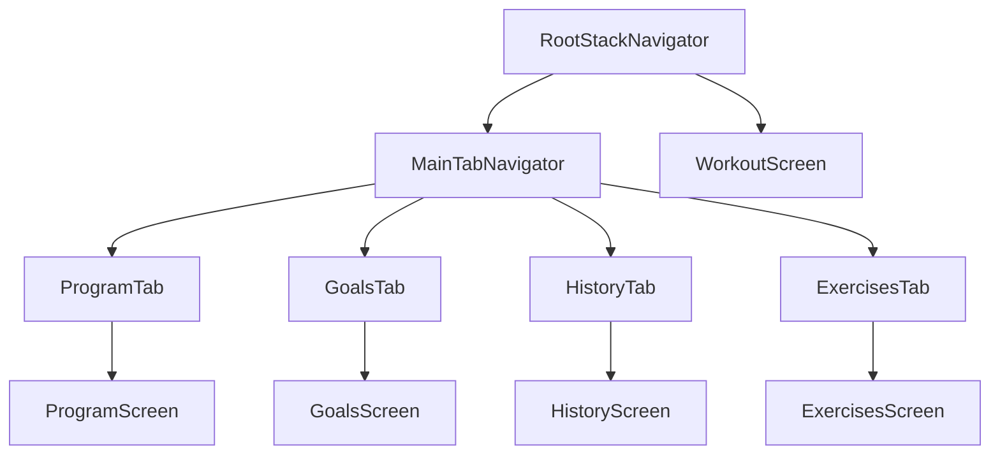

## Navigation Architecture

Rippler uses **React Navigation v6** with a nested navigator structure:



<Note>
This nested structure provides tab-based navigation on the main screen with the ability to push full-screen modals (like WorkoutScreen) on top.
</Note>

## Navigator Hierarchy

### Root Stack Navigator

The top-level navigator manages the core app flow:

```tsx client/navigation/RootStackNavigator.tsx
import React from "react";
import { createNativeStackNavigator } from "@react-navigation/native-stack";
import MainTabNavigator from "@/navigation/MainTabNavigator";
import WorkoutScreen from "@/screens/WorkoutScreen";
import { useScreenOptions } from "@/hooks/useScreenOptions";

export type RootStackParamList = {
  Main: undefined;
  Workout: { week: number; day: string };
};

const Stack = createNativeStackNavigator<RootStackParamList>();

export default function RootStackNavigator() {
  const screenOptions = useScreenOptions();

  return (
    <Stack.Navigator screenOptions={screenOptions}>
      <Stack.Screen
        name="Main"
        component={MainTabNavigator}
        options={{ headerShown: false }}
      />
      <Stack.Screen
        name="Workout"
        component={WorkoutScreen}
        options={{
          headerTitle: "Log Workout",
        }}
      />
    </Stack.Navigator>
  );
}
```

<ParamField path="Main" type="undefined">
  The main tab navigator (no params required)
</ParamField>
<ParamField path="Workout" type="object">
  Full-screen workout logging modal
  <Expandable title="parameters">
    <ParamField path="week" type="number" required>
      Current program week (1-12)
    </ParamField>
    <ParamField path="day" type="string" required>
      Day of the week (e.g., "Monday", "Tuesday")
    </ParamField>
  </Expandable>
</ParamField>

### Main Tab Navigator

The bottom tab bar provides access to the four main sections:

```tsx client/navigation/MainTabNavigator.tsx
import React from "react";
import { createBottomTabNavigator } from "@react-navigation/bottom-tabs";
import { Feather } from "@expo/vector-icons";
import { BlurView } from "expo-blur";
import { Platform, StyleSheet } from "react-native";
import ProgramStackNavigator from "@/navigation/ProgramStackNavigator";
import HistoryStackNavigator from "@/navigation/HistoryStackNavigator";
import ExercisesStackNavigator from "@/navigation/ExercisesStackNavigator";
import GoalsStackNavigator from "@/navigation/GoalsStackNavigator";
import { useTheme } from "@/hooks/useTheme";

export type MainTabParamList = {
  ProgramTab: undefined;
  GoalsTab: undefined;
  HistoryTab: undefined;
  ExercisesTab: undefined;
};

const Tab = createBottomTabNavigator<MainTabParamList>();

export default function MainTabNavigator() {
  const { theme, isDark } = useTheme();

  return (
    <Tab.Navigator
      initialRouteName="ProgramTab"
      screenOptions={{
        tabBarActiveTintColor: theme.tabIconSelected,
        tabBarInactiveTintColor: theme.tabIconDefault,
        tabBarStyle: {
          position: "absolute",
          backgroundColor: Platform.select({
            ios: "transparent",
            android: theme.backgroundRoot,
          }),
          borderTopWidth: 0,
          elevation: 0,
        },
        tabBarBackground: () =>
          Platform.OS === "ios" ? (
            <BlurView
              intensity={100}
              tint={isDark ? "dark" : "light"}
              style={StyleSheet.absoluteFill}
            />
          ) : null,
        headerShown: false,
      }}
    >
      <Tab.Screen
        name="ProgramTab"
        component={ProgramStackNavigator}
        options={{
          title: "Program",
          tabBarIcon: ({ color, size }) => (
            <Feather name="calendar" size={size} color={color} />
          ),
        }}
      />
      <Tab.Screen
        name="GoalsTab"
        component={GoalsStackNavigator}
        options={{
          title: "Goals",
          tabBarIcon: ({ color, size }) => (
            <Feather name="target" size={size} color={color} />
          ),
        }}
      />
      <Tab.Screen
        name="HistoryTab"
        component={HistoryStackNavigator}
        options={{
          title: "History",
          tabBarIcon: ({ color, size }) => (
            <Feather name="bar-chart-2" size={size} color={color} />
          ),
        }}
      />
      <Tab.Screen
        name="ExercisesTab"
        component={ExercisesStackNavigator}
        options={{
          title: "Exercises",
          tabBarIcon: ({ color, size }) => (
            <Feather name="list" size={size} color={color} />
          ),
        }}
      />
    </Tab.Navigator>
  );
}
```

## Tab Screens

<Tabs>
  <Tab title="Program">
    **ProgramTab** shows the workout program calendar:
    
    ```tsx client/navigation/ProgramStackNavigator.tsx
    import React from "react";
    import { createNativeStackNavigator } from "@react-navigation/native-stack";
    import ProgramScreen from "@/screens/ProgramScreen";
    import { HeaderTitle } from "@/components/HeaderTitle";
    import { useScreenOptions } from "@/hooks/useScreenOptions";
    
    export type ProgramStackParamList = {
      Program: undefined;
    };
    
    const Stack = createNativeStackNavigator<ProgramStackParamList>();
    
    export default function ProgramStackNavigator() {
      const screenOptions = useScreenOptions();
    
      return (
        <Stack.Navigator screenOptions={screenOptions}>
          <Stack.Screen
            name="Program"
            component={ProgramScreen}
            options={{
              headerTitle: () => <HeaderTitle title="Rippler" />,
            }}
          />
        </Stack.Navigator>
      );
    }
    ```
    
    <Check>Uses custom `HeaderTitle` component for branding</Check>
  </Tab>
  
  <Tab title="Goals">
    **GoalsTab** tracks target weights and progression:
    
    ```tsx client/navigation/GoalsStackNavigator.tsx
    export type GoalsStackParamList = {
      Goals: undefined;
    };
    ```
  </Tab>
  
  <Tab title="History">
    **HistoryTab** displays workout history and stats:
    
    ```tsx client/navigation/HistoryStackNavigator.tsx
    import React from "react";
    import { createNativeStackNavigator } from "@react-navigation/native-stack";
    import HistoryScreen from "@/screens/HistoryScreen";
    import { useScreenOptions } from "@/hooks/useScreenOptions";
    
    export type HistoryStackParamList = {
      History: undefined;
    };
    
    const Stack = createNativeStackNavigator<HistoryStackParamList>();
    
    export default function HistoryStackNavigator() {
      const screenOptions = useScreenOptions();
    
      return (
        <Stack.Navigator screenOptions={screenOptions}>
          <Stack.Screen
            name="History"
            component={HistoryScreen}
            options={{
              headerTitle: "History",
            }}
          />
        </Stack.Navigator>
      );
    }
    ```
  </Tab>
  
  <Tab title="Exercises">
    **ExercisesTab** manages exercise library:
    
    ```tsx client/navigation/ExercisesStackNavigator.tsx
    export type ExercisesStackParamList = {
      Exercises: undefined;
    };
    ```
  </Tab>
</Tabs>

## Screen Options Hook

Centralized screen configuration using a custom hook:

```tsx client/hooks/useScreenOptions.ts
import { Platform } from "react-native";
import { NativeStackNavigationOptions } from "@react-navigation/native-stack";
import { isLiquidGlassAvailable } from "expo-glass-effect";
import { useTheme } from "@/hooks/useTheme";

interface UseScreenOptionsParams {
  transparent?: boolean;
}

export function useScreenOptions({
  transparent = true,
}: UseScreenOptionsParams = {}): NativeStackNavigationOptions {
  const { theme, isDark } = useTheme();

  return {
    headerTitleAlign: "center",
    headerTransparent: transparent,
    headerBlurEffect: isDark ? "dark" : "light",
    headerTintColor: theme.text,
    headerStyle: {
      backgroundColor: Platform.select({
        ios: undefined,
        android: theme.backgroundRoot,
        web: theme.backgroundRoot,
      }),
    },
    gestureEnabled: true,
    gestureDirection: "horizontal",
    fullScreenGestureEnabled: isLiquidGlassAvailable() ? false : true,
    contentStyle: {
      backgroundColor: theme.backgroundRoot,
    },
  };
}
```

<ResponseField name="headerTitleAlign" type="'center'">
  Centers header title on all platforms
</ResponseField>
<ResponseField name="headerTransparent" type="boolean">
  Makes header transparent on iOS (shows blur effect)
</ResponseField>
<ResponseField name="headerBlurEffect" type="'dark' | 'light'">
  Native blur effect based on color scheme
</ResponseField>
<ResponseField name="gestureEnabled" type="true">
  Enables swipe-back gesture navigation
</ResponseField>
<ResponseField name="contentStyle" type="object">
  Sets screen background color to match theme
</ResponseField>

## Navigation Patterns

### Type-Safe Navigation

Use TypeScript for compile-time route safety:

```tsx Type-Safe Navigation
import { NativeStackNavigationProp } from '@react-navigation/native-stack';
import { RootStackParamList } from '@/navigation/RootStackNavigator';

type WorkoutNavigationProp = NativeStackNavigationProp<RootStackParamList, 'Workout'>;

function ProgramScreen() {
  const navigation = useNavigation<WorkoutNavigationProp>();
  
  const handleStartWorkout = (week: number, day: string) => {
    // TypeScript ensures we pass correct params
    navigation.navigate('Workout', { week, day });
  };
}
```

### Accessing Route Params

```tsx Route Params
import { RouteProp } from '@react-navigation/native';
import { RootStackParamList } from '@/navigation/RootStackNavigator';

type WorkoutRouteProp = RouteProp<RootStackParamList, 'Workout'>;

function WorkoutScreen() {
  const route = useRoute<WorkoutRouteProp>();
  const { week, day } = route.params;
  
  return (
    <View>
      <Text>Week {week} - {day}</Text>
    </View>
  );
}
```

### Going Back

```tsx Navigation Back
function WorkoutScreen() {
  const navigation = useNavigation();
  
  const handleComplete = async () => {
    await saveLoggedWorkout(workout);
    navigation.goBack();
  };
}
```

### Tab Navigation

```tsx Switching Tabs
import { BottomTabNavigationProp } from '@react-navigation/bottom-tabs';
import { MainTabParamList } from '@/navigation/MainTabNavigator';

type TabNavigationProp = BottomTabNavigationProp<MainTabParamList>;

function ProgramScreen() {
  const navigation = useNavigation<TabNavigationProp>();
  
  const viewHistory = () => {
    navigation.navigate('HistoryTab');
  };
}
```

## Platform-Specific Navigation

### iOS Features

<CardGroup cols={2}>
  <Card title="Blur Headers" icon="sparkles">
    Translucent headers with native blur effect
  </Card>
  <Card title="Swipe Gestures" icon="hand">
    Full-screen swipe-back gesture support
  </Card>
  <Card title="Blur Tab Bar" icon="window-maximize">
    Translucent tab bar using BlurView
  </Card>
  <Card title="Safe Areas" icon="shield">
    Automatic handling of notches and home indicator
  </Card>
</CardGroup>

```tsx iOS Blur Implementation
tabBarBackground: () =>
  Platform.OS === "ios" ? (
    <BlurView
      intensity={100}
      tint={isDark ? "dark" : "light"}
      style={StyleSheet.absoluteFill}
    />
  ) : null,
```

### Android Features

- **Solid backgrounds** for better performance
- **Back button** hardware support (automatic)
- **Status bar** color coordination
- **No blur effects** (not supported natively)

```tsx Android Tab Bar
tabBarStyle: {
  position: "absolute",
  backgroundColor: Platform.select({
    ios: "transparent",
    android: theme.backgroundRoot, // Solid color
  }),
  borderTopWidth: 0,
  elevation: 0,
},
```

## Deep Linking

<Warning>
Deep linking is not yet implemented but can be added via React Navigation's linking configuration.
</Warning>

```tsx Deep Linking Setup (Future)
const linking = {
  prefixes: ['rippler://', 'https://rippler.app'],
  config: {
    screens: {
      Main: {
        screens: {
          ProgramTab: 'program',
          HistoryTab: 'history',
          GoalsTab: 'goals',
          ExercisesTab: 'exercises',
        },
      },
      Workout: 'workout/:week/:day',
    },
  },
};

<NavigationContainer linking={linking}>
  <RootStackNavigator />
</NavigationContainer>
```

## Navigation State Persistence

<Info>
Navigation state is automatically persisted by React Navigation when the app backgrounds.
</Info>

To implement custom persistence:

```tsx State Persistence
import AsyncStorage from '@react-native-async-storage/async-storage';

const NAVIGATION_STATE_KEY = '@rippler/navigation_state';

function App() {
  const [initialState, setInitialState] = useState();

  useEffect(() => {
    const restoreState = async () => {
      const savedState = await AsyncStorage.getItem(NAVIGATION_STATE_KEY);
      if (savedState) {
        setInitialState(JSON.parse(savedState));
      }
    };
    restoreState();
  }, []);

  const saveState = (state) => {
    AsyncStorage.setItem(NAVIGATION_STATE_KEY, JSON.stringify(state));
  };

  return (
    <NavigationContainer
      initialState={initialState}
      onStateChange={saveState}
    >
      <RootStackNavigator />
    </NavigationContainer>
  );
}
```

## Best Practices

<AccordionGroup>
  <Accordion title="Use TypeScript param lists">
    Always define param lists for type safety. This prevents runtime errors from incorrect navigation params.
  </Accordion>
  
  <Accordion title="Centralize screen options">
    Use the `useScreenOptions` hook to maintain consistent navigation styling across all screens.
  </Accordion>
  
  <Accordion title="Avoid deeply nested navigators">
    Keep navigator hierarchy shallow (max 3 levels). Deep nesting causes performance issues.
  </Accordion>
  
  <Accordion title="Handle navigation in callbacks">
    Don't navigate during render. Use useEffect or event handlers.
  </Accordion>
  
  <Accordion title="Reset navigation state on logout">
    Use `navigation.reset()` when user logs out to clear the navigation stack.
  </Accordion>
</AccordionGroup>

## Troubleshooting

<AccordionGroup>
  <Accordion title="Screen not updating after navigation">
    Use `useFocusEffect` instead of `useEffect` to run code when screen gains focus:
    
    ```tsx
    import { useFocusEffect } from '@react-navigation/native';
    
    useFocusEffect(
      React.useCallback(() => {
        // Runs when screen gains focus
        fetchData();
      }, [])
    );
    ```
  </Accordion>
  
  <Accordion title="Tab bar overlapping content">
    Add bottom padding equal to tab bar height:
    
    ```tsx
    <ScrollView contentContainerStyle={{ paddingBottom: 80 }}>
      {/* Content */}
    </ScrollView>
    ```
  </Accordion>
  
  <Accordion title="Gestures not working">
    Ensure `GestureHandlerRootView` wraps the entire app in App.tsx:1
  </Accordion>
</AccordionGroup>

## Related Documentation

<CardGroup cols={2}>
  <Card title="Theming" icon="palette" href="/architecture/theming">
    Learn how navigation adapts to theme changes
  </Card>
  <Card title="Screens" icon="window" href="/screens/overview">
    Explore individual screen implementations
  </Card>
</CardGroup>