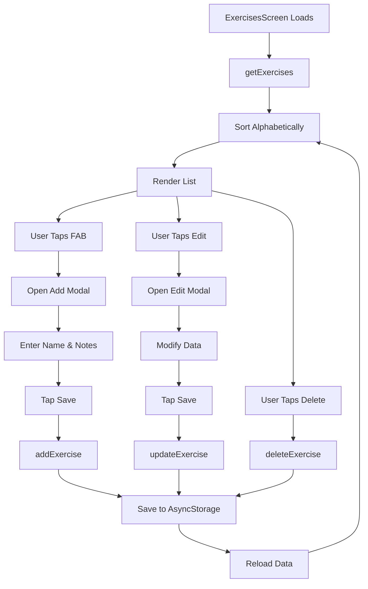

The **ExercisesScreen** component provides a management interface for custom exercises. Users can add, edit, and delete exercises, with support for notes about form, cues, or variations.

## Overview

This screen allows users to:
- View all custom exercises in alphabetical order
- Add new exercises to their personal library
- Edit existing exercise names and notes
- Delete exercises from the library
- Track the total count of exercises

Location: `~/workspace/source/client/screens/ExercisesScreen.tsx`

## Key Features

<CardGroup cols={2}>
  <Card title="Exercise Library" icon="book">
    Alphabetically sorted list of all custom exercises
  </Card>
  <Card title="CRUD Operations" icon="pen-to-square">
    Full create, read, update, and delete functionality
  </Card>
  <Card title="Exercise Notes" icon="note-sticky">
    Optional notes for form cues, tips, or variations
  </Card>
  <Card title="Floating Action Button" icon="plus">
    Quick access to add new exercises
  </Card>
</CardGroup>

## State Management

```typescript
const [exercises, setExercises] = useState<Exercise[]>([]);
const [refreshing, setRefreshing] = useState(false);
const [modalVisible, setModalVisible] = useState(false);
const [editingExercise, setEditingExercise] = useState<Exercise | null>(null);
const [exerciseName, setExerciseName] = useState("");
const [exerciseNotes, setExerciseNotes] = useState("");
```

### Exercise Type

```typescript
interface Exercise {
  id: string;
  name: string;
  notes?: string;
}
```

## Data Loading

```typescript
const loadData = async () => {
  const loaded = await getExercises();
  setExercises(loaded.sort((a, b) => a.name.localeCompare(b.name)));
};
```

<Tabs>
  <Tab title="Initial Load">
    ```typescript
    useEffect(() => {
      loadData();
    }, []);
    ```
  </Tab>
  <Tab title="Focus Effect">
    ```typescript
    useFocusEffect(
      useCallback(() => {
        loadData();
      }, [])
    );
    ```
  </Tab>
  <Tab title="Pull to Refresh">
    ```typescript
    const onRefresh = async () => {
      setRefreshing(true);
      await loadData();
      setRefreshing(false);
    };
    ```
  </Tab>
</Tabs>

<Note>
  Exercises are automatically sorted alphabetically using `localeCompare` for consistent ordering.
</Note>

## ExerciseRow Component

```typescript
interface ExerciseRowProps {
  exercise: Exercise;
  onEdit: () => void;
  onDelete: () => void;
}

function ExerciseRow({ exercise, onEdit, onDelete }: ExerciseRowProps) {
  const { theme } = useTheme();
  const scale = useSharedValue(1);

  const animatedStyle = useAnimatedStyle(() => ({
    transform: [{ scale: scale.value }],
  }));

  const handlePressIn = () => {
    scale.value = withSpring(0.98, { damping: 15 });
  };

  const handlePressOut = () => {
    scale.value = withSpring(1, { damping: 15 });
  };

  return (
    <AnimatedPressable
      onPress={onEdit}
      onPressIn={handlePressIn}
      onPressOut={handlePressOut}
      style={[styles.exerciseRow, animatedStyle]}
    >
      <View style={styles.exerciseInfo}>
        <ThemedText type="body" style={styles.exerciseName}>
          {exercise.name}
        </ThemedText>
        {exercise.notes && (
          <ThemedText
            style={[styles.exerciseNotes, { color: theme.textSecondary }]}
            numberOfLines={1}
          >
            {exercise.notes}
          </ThemedText>
        )}
      </View>
      <View style={styles.exerciseActions}>
        <Pressable onPress={onEdit} style={styles.actionButton}>
          <Feather name="edit-2" size={16} color={theme.primary} />
        </Pressable>
        <Pressable onPress={onDelete} style={styles.actionButton}>
          <Feather name="trash-2" size={16} color={theme.textSecondary} />
        </Pressable>
      </View>
    </AnimatedPressable>
  );
}
```

<Info>
  Each row uses react-native-reanimated for smooth press animations and includes dedicated edit/delete buttons.
</Info>

## CRUD Operations

<Tabs>
  <Tab title="Create (Add)">
    ```typescript
    const openAddModal = () => {
      setEditingExercise(null);
      setExerciseName("");
      setExerciseNotes("");
      setModalVisible(true);
    };

    const handleSave = async () => {
      if (!exerciseName.trim()) return;

      if (Platform.OS !== "web") {
        Haptics.impactAsync(Haptics.ImpactFeedbackStyle.Light);
      }

      await addExercise(exerciseName.trim(), exerciseNotes.trim() || undefined);
      
      setModalVisible(false);
      await loadData();
    };
    ```
  </Tab>
  <Tab title="Read (View)">
    ```typescript
    const renderItem = ({ item }: { item: Exercise }) => (
      <ExerciseRow
        exercise={item}
        onEdit={() => openEditModal(item)}
        onDelete={() => handleDelete(item.id)}
      />
    );
    ```
  </Tab>
  <Tab title="Update (Edit)">
    ```typescript
    const openEditModal = (exercise: Exercise) => {
      setEditingExercise(exercise);
      setExerciseName(exercise.name);
      setExerciseNotes(exercise.notes || "");
      setModalVisible(true);
    };

    const handleSave = async () => {
      if (!exerciseName.trim()) return;

      if (editingExercise) {
        await updateExercise(editingExercise.id, {
          name: exerciseName.trim(),
          notes: exerciseNotes.trim() || undefined,
        });
      }
      
      setModalVisible(false);
      await loadData();
    };
    ```
  </Tab>
  <Tab title="Delete">
    ```typescript
    const handleDelete = async (id: string) => {
      if (Platform.OS !== "web") {
        Haptics.impactAsync(Haptics.ImpactFeedbackStyle.Medium);
      }
      await deleteExercise(id);
      await loadData();
    };
    ```
  </Tab>
</Tabs>

<Warning>
  Deletion is immediate with no confirmation. Consider adding a confirmation dialog for better UX.
</Warning>

## Add/Edit Modal

The modal serves both add and edit functionality:

```tsx
<Modal
  visible={modalVisible}
  animationType="slide"
  presentationStyle="pageSheet"
  onRequestClose={() => setModalVisible(false)}
>
  <View style={styles.modalContainer}>
    {/* Header with Cancel/Save */}
    <View style={styles.modalHeader}>
      <Pressable onPress={() => setModalVisible(false)}>
        <ThemedText style={{ color: theme.primary }}>Cancel</ThemedText>
      </Pressable>
      <ThemedText type="h4">
        {editingExercise ? "Edit Exercise" : "Add Exercise"}
      </ThemedText>
      <Pressable onPress={handleSave}>
        <ThemedText
          style={{
            color: exerciseName.trim() ? theme.primary : theme.disabled,
          }}
        >
          Save
        </ThemedText>
      </Pressable>
    </View>

    <View style={styles.modalContent}>
      {/* Exercise Name Input */}
      <View style={styles.inputGroup}>
        <ThemedText style={styles.inputLabel}>Exercise Name</ThemedText>
        <TextInput
          style={styles.input}
          value={exerciseName}
          onChangeText={setExerciseName}
          placeholder="e.g., Bench Press"
          autoFocus
          testID="exercise-name-input"
        />
      </View>

      {/* Notes Input */}
      <View style={styles.inputGroup}>
        <ThemedText style={styles.inputLabel}>Notes (optional)</ThemedText>
        <TextInput
          style={[styles.input, styles.textArea]}
          value={exerciseNotes}
          onChangeText={setExerciseNotes}
          placeholder="Add notes about form, cues, etc."
          multiline
          numberOfLines={3}
          textAlignVertical="top"
          testID="exercise-notes-input"
        />
      </View>
    </View>
  </View>
</Modal>
```

<Info>
  The modal title and behavior change based on whether `editingExercise` is null (add mode) or populated (edit mode).
</Info>

## Floating Action Button (FAB)

```tsx
<View
  style={[
    styles.fabContainer,
    { bottom: tabBarHeight + Spacing.lg },
  ]}
>
  <Pressable
    onPress={openAddModal}
    style={[styles.fab, { backgroundColor: theme.primary }]}
  >
    <Feather name="plus" size={24} color="#FFFFFF" />
  </>
</View>
```

The FAB is positioned above the tab bar for easy access:

```typescript
const fabContainer: ViewStyle = {
  position: "absolute",
  right: Spacing.lg,
};

const fab: ViewStyle = {
  width: 56,
  height: 56,
  borderRadius: 28,
  alignItems: "center",
  justifyContent: "center",
  shadowColor: "#000",
  shadowOffset: { width: 0, height: 2 },
  shadowOpacity: 0.15,
  shadowRadius: 4,
  elevation: 4,
};
```

## Header with Count

```typescript
const renderHeader = () => (
  <View style={styles.header}>
    <ThemedText type="h1">Exercises</ThemedText>
    <ThemedText style={[styles.subtitle, { color: theme.textSecondary }]}>
      {exercises.length} exercises in your library
    </ThemedText>
  </View>
);
```

Displays the total count of exercises in the user's library.

## FlatList Implementation

```tsx
<FlatList
  style={styles.list}
  contentContainerStyle={{
    paddingTop: headerHeight + Spacing.xl,
    paddingBottom: tabBarHeight + Spacing["4xl"],
    paddingHorizontal: Spacing.lg,
  }}
  scrollIndicatorInsets={{ bottom: insets.bottom }}
  data={exercises}
  renderItem={renderItem}
  keyExtractor={(item) => item.id}
  ListHeaderComponent={renderHeader}
  refreshControl={
    <RefreshControl refreshing={refreshing} onRefresh={onRefresh} />
  }
/>
```

<Note>
  Extra bottom padding (`4xl`) ensures the last item is not obscured by the FAB.
</Note>

## Storage Layer

Exercises are persisted using AsyncStorage:

```typescript
// lib/storage.ts
export const getExercises = async (): Promise<Exercise[]> => {
  const data = await AsyncStorage.getItem(EXERCISES_KEY);
  return data ? JSON.parse(data) : [];
};

export const addExercise = async (
  name: string,
  notes?: string
): Promise<void> => {
  const exercises = await getExercises();
  const newExercise: Exercise = {
    id: Date.now().toString(),
    name,
    notes,
  };
  exercises.push(newExercise);
  await AsyncStorage.setItem(EXERCISES_KEY, JSON.stringify(exercises));
};

export const updateExercise = async (
  id: string,
  updates: Partial<Exercise>
): Promise<void> => {
  const exercises = await getExercises();
  const index = exercises.findIndex((e) => e.id === id);
  if (index !== -1) {
    exercises[index] = { ...exercises[index], ...updates };
    await AsyncStorage.setItem(EXERCISES_KEY, JSON.stringify(exercises));
  }
};

export const deleteExercise = async (id: string): Promise<void> => {
  const exercises = await getExercises();
  const filtered = exercises.filter((e) => e.id !== id);
  await AsyncStorage.setItem(EXERCISES_KEY, JSON.stringify(filtered));
};
```

## Data Flow



## Validation

```typescript
const handleSave = async () => {
  if (!exerciseName.trim()) return;
  // ... save logic
};
```

The save button is disabled (via opacity/color) when the exercise name is empty:

```tsx
<ThemedText
  style={{
    color: exerciseName.trim() ? theme.primary : theme.disabled,
  }}
>
  Save
</ThemedText>
```

## Haptic Feedback

```typescript
if (Platform.OS !== "web") {
  // Light feedback for save
  Haptics.impactAsync(Haptics.ImpactFeedbackStyle.Light);
  
  // Medium feedback for delete
  Haptics.impactAsync(Haptics.ImpactFeedbackStyle.Medium);
}
```

Provides tactile feedback on mobile devices for important actions.

## Use Cases

<AccordionGroup>
  <Accordion title="Personal Exercise Variations">
    Users can track variations of standard exercises:
    
    - "Bench Press (Close Grip)"
    - "Squat (Pause)"
    - "Deadlift (Deficit)"
    
    With notes about technique differences.
  </Accordion>
  
  <Accordion title="Form Cues">
    Store mental cues for proper form:
    
    - Exercise: "Bench Press"
    - Notes: "Retract scapula, drive through floor, touch chest"
  </Accordion>
  
  <Accordion title="Equipment Variations">
    Track equipment-specific exercises:
    
    - "Dumbbell Bench Press"
    - "Cable Flyes"
    - "Machine Leg Press"
  </Accordion>
  
  <Accordion title="Specialty Exercises">
    Add niche or sport-specific movements not in the default program.
  </Accordion>
</AccordionGroup>

## Best Practices

<Steps>
  <Step title="Alphabetical Sorting">
    Always sort exercises alphabetically for easy navigation
  </Step>
  <Step title="Trim Input">
    Trim whitespace from names and notes before saving
  </Step>
  <Step title="Optional Notes">
    Make notes optional with clear placeholder text
  </Step>
  <Step title="Haptic Feedback">
    Provide tactile feedback for actions on mobile
  </Step>
  <Step title="Auto-focus Name">
    Auto-focus the name input when opening the modal
  </Step>
  <Step title="Test IDs">
    Include testID props for automated testing
  </Step>
</Steps>

## Layout Considerations

```typescript
const insets = useSafeAreaInsets();
const headerHeight = useHeaderHeight();
const tabBarHeight = useBottomTabBarHeight();

contentContainerStyle={{
  paddingTop: headerHeight + Spacing.xl,
  paddingBottom: tabBarHeight + Spacing["4xl"], // Extra space for FAB
  paddingHorizontal: Spacing.lg,
}}
```

<Warning>
  The FAB overlays content, so ensure adequate bottom padding on the FlatList to prevent the last item from being obscured.
</Warning>

## Future Enhancements

- **Search/Filter**: Add search bar for large exercise libraries
- **Categories**: Group exercises by type (upper body, lower body, etc.)
- **Usage Stats**: Show how many times each exercise has been logged
- **Import/Export**: Share exercise libraries between users
- **Images**: Attach reference images or videos

## Related Components

- [WorkoutScreen](/screens/workout-screen) - Could integrate custom exercises in future
- [Storage API](/api/storage/exercises) - Exercise CRUD operations and persistence