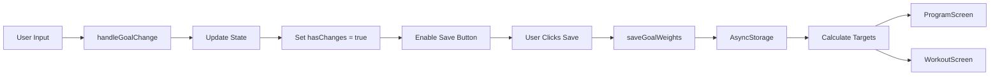

The **GoalsScreen** component allows users to set their goal weights (1RM or training maxes) for all exercises in the Rippler program. These values are used to calculate target weights throughout the 12-week training cycle.

## Overview

The GoalsScreen provides a categorized interface for entering goal weights across three tiers:
- **T1 (Main Lifts)**: The four primary compound movements with 1RM goals
- **T2 (Secondary Lifts)**: Supporting compound movements
- **T3 (Accessories)**: Isolation and accessory work

Location: `~/workspace/source/client/screens/GoalsScreen.tsx`

## Key Features

<CardGroup cols={2}>
  <Card title="Tiered Exercise Organization" icon="layer-group">
    Exercises grouped by tier (T1/T2/T3) for clear hierarchy
  </Card>
  <Card title="Persistent Storage" icon="floppy-disk">
    Goal weights saved to AsyncStorage and persist across sessions
  </Card>
  <Card title="Change Tracking" icon="pencil">
    Visual feedback when goals are modified but not saved
  </Card>
  <Card title="Bodyweight Handling" icon="weight">
    Special handling for bodyweight exercises like pull-ups
  </Card>
</CardGroup>

## State Management

```typescript
const [goals, setGoals] = useState<Record<string, number>>({});
const [loading, setLoading] = useState(true);
const [saving, setSaving] = useState(false);
const [hasChanges, setHasChanges] = useState(false);
```

### Loading Goals

The component loads goals on mount and when focused:

```typescript
const loadGoals = useCallback(async () => {
  setLoading(true);
  try {
    const savedGoals = await getGoalWeights();
    const defaultGoals = getDefaultGoals();
    const mergedGoals = { ...defaultGoals, ...savedGoals };
    setGoals(mergedGoals);
    setHasChanges(false);
  } catch (error) {
    console.error("Error loading goals:", error);
  } finally {
    setLoading(false);
  }
}, []);

useFocusEffect(
  useCallback(() => {
    loadGoals();
  }, [loadGoals])
);
```

<Note>
  The component merges saved goals with defaults to ensure all exercises have values, even if the user hasn't set them yet.
</Note>

## User Interactions

<Tabs>
  <Tab title="Editing Goals">
    ```typescript
    const handleGoalChange = (exercise: string, value: string) => {
      const numValue = parseFloat(value) || 0;
      setGoals((prev) => ({ ...prev, [exercise]: numValue }));
      setHasChanges(true);
    };
    ```
    
    Input fields update the goals state immediately and mark `hasChanges` as true.
  </Tab>
  <Tab title="Saving Goals">
    ```typescript
    const handleSave = async () => {
      setSaving(true);
      try {
        await saveGoalWeights(goals);
        if (Platform.OS !== "web") {
          Haptics.notificationAsync(Haptics.NotificationFeedbackType.Success);
        }
        setHasChanges(false);
      } catch (error) {
        console.error("Error saving goals:", error);
      } finally {
        setSaving(false);
      }
    };
    ```
    
    Saves goals to storage with haptic feedback on mobile platforms.
  </Tab>
  <Tab title="Reset to Defaults">
    ```typescript
    const handleReset = () => {
      const defaultGoals = getDefaultGoals();
      setGoals(defaultGoals);
      setHasChanges(true);
    };
    ```
    
    Resets all goals to program defaults without saving immediately.
  </Tab>
</Tabs>

## Exercise Input Rendering

```typescript
const renderExerciseInput = (exercise: string, label?: string) => {
  const isBodyweight = exercise === "Pull Ups";

  return (
    <View key={exercise} style={styles.inputRow}>
      <ThemedText style={styles.exerciseLabel}>
        {label || exercise}
      </ThemedText>
      {isBodyweight ? (
        <View style={[styles.inputDisabled, { backgroundColor: theme.backgroundSecondary }]}>
          <ThemedText style={styles.bodyweightText}>BW</ThemedText>
        </View>
      ) : (
        <TextInput
          style={[styles.input, { /* theme styles */ }]}
          value={goals[exercise]?.toString() || ""}
          onChangeText={(text) => handleGoalChange(exercise, text)}
          keyboardType="decimal-pad"
          placeholder="0"
        />
      )}
      <ThemedText style={styles.unitLabel}>lbs</ThemedText>
    </View>
  );
};
```

<Warning>
  Bodyweight exercises like pull-ups display "BW" instead of an input field, since the weight calculation is based on the user's bodyweight.
</Warning>

## UI Structure

```tsx
<ScrollView>
  <ThemedText style={styles.description}>
    Enter your goal or training max for each exercise. Targets throughout
    the 12-week program will be calculated based on these values.
  </ThemedText>

  {/* T1 Main Lifts */}
  <Card>
    <ThemedText style={styles.sectionTitle}>T1 - Main Lifts (1RM Goals)</ThemedText>
    {mainLifts.map((exercise) => renderExerciseInput(exercise))}
  </Card>

  {/* T2 Secondary Lifts */}
  <Card>
    <ThemedText style={styles.sectionTitle}>T2 - Secondary Lifts</ThemedText>
    {t2Lifts.map((exercise) => renderExerciseInput(exercise))}
  </Card>

  {/* T3 Accessories */}
  <Card>
    <ThemedText style={styles.sectionTitle}>T3 - Accessories</ThemedText>
    {t3Lifts.map((exercise) => renderExerciseInput(exercise))}
  </Card>

  <View style={styles.buttonRow}>
    <Pressable onPress={handleReset}>Reset Defaults</Pressable>
    <Pressable 
      onPress={handleSave} 
      disabled={saving || !hasChanges}
      style={{ backgroundColor: hasChanges ? theme.primary : theme.border }}
    >
      {saving ? <ActivityIndicator /> : "Save Goals"}
    </Pressable>
  </View>
</ScrollView>
```

## Data Flow



## Integration with Other Components

<AccordionGroup>
  <Accordion title="ProgramScreen Integration">
    The ProgramScreen loads goal weights to display the main lift target weight for each workout day:
    
    ```typescript
    const [goalWeights, setGoalWeights] = useState<Record<string, number>>({});
    
    const loadData = async () => {
      const goals = await getGoalWeights();
      setGoalWeights(goals);
    };
    
    const getMainLiftWeight = (workout: WorkoutDay): number | string | undefined => {
      const mergedGoals = { ...getDefaultGoals(), ...goalWeights };
      const calculatedWeight = calculateTargetWeight(
        mainLift.exercise,
        workout.week,
        workout.day,
        mainLiftIndex,
        mergedGoals
      );
      return calculatedWeight;
    };
    ```
  </Accordion>
  
  <Accordion title="WorkoutScreen Integration">
    The WorkoutScreen uses goal weights to calculate target weights for all exercises:
    
    ```typescript
    const getEffectiveTarget = useCallback((target: TargetExercise, index: number) => {
      const mergedGoals = { ...getDefaultGoals(), ...goalWeights };
      const calculatedWeight = calculateTargetWeight(
        target.exercise,
        week,
        day,
        index,
        mergedGoals
      );
      return calculatedWeight;
    }, [goalWeights, week, day]);
    ```
  </Accordion>
  
  <Accordion title="Storage Layer">
    Goal weights are persisted using AsyncStorage:
    
    ```typescript
    // lib/storage.ts
    export const getGoalWeights = async (): Promise<Record<string, number>> => {
      const data = await AsyncStorage.getItem(GOAL_WEIGHTS_KEY);
      return data ? JSON.parse(data) : {};
    };
    
    export const saveGoalWeights = async (goals: Record<string, number>): Promise<void> => {
      await AsyncStorage.setItem(GOAL_WEIGHTS_KEY, JSON.stringify(goals));
    };
    ```
  </Accordion>
</AccordionGroup>

## Layout & Styling

The screen uses navigation hooks for proper spacing:

```typescript
const headerHeight = useHeaderHeight();
const tabBarHeight = useBottomTabBarHeight();

<ScrollView
  contentContainerStyle={[
    styles.scrollContent,
    {
      paddingTop: headerHeight + Spacing.md,
      paddingBottom: tabBarHeight + Spacing.xl,
    },
  ]}
>
```

<Info>
  The save button changes color based on `hasChanges` state, providing clear visual feedback when modifications are pending.
</Info>

## Best Practices

<Steps>
  <Step title="Load on Focus">
    Use `useFocusEffect` to reload goals when the screen gains focus, ensuring data stays fresh
  </Step>
  <Step title="Merge with Defaults">
    Always merge saved goals with defaults to handle new exercises or missing data
  </Step>
  <Step title="Track Changes">
    Maintain a `hasChanges` flag to enable/disable the save button and prevent unnecessary saves
  </Step>
  <Step title="Handle Bodyweight">
    Special case bodyweight exercises to prevent user confusion
  </Step>
  <Step title="Provide Feedback">
    Use haptic feedback on mobile to confirm successful saves
  </Step>
</Steps>

## Related Components

- [ProgramScreen](/screens/program-screen) - Displays workout days with calculated weights
- [WorkoutScreen](/screens/workout-screen) - Uses goals to calculate exercise targets
- [Data Flow](/architecture/data-flow) - How goal weights flow through the app