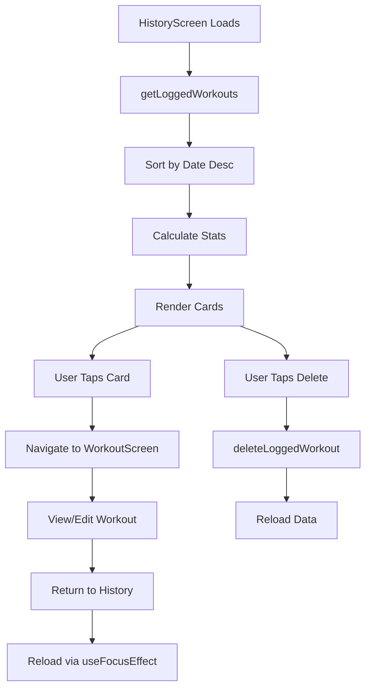

The **HistoryScreen** component displays a chronological list of all logged workouts, showing completion status, statistics, and providing navigation back to individual workout details.

## Overview

This screen serves as a workout journal, allowing users to:
- View all logged workouts in reverse chronological order
- See completion statistics (completed count vs total logged)
- Review workout details (sets completed, exercises performed)
- Navigate back to specific workouts to view or edit
- Delete workout logs

Location: `~/workspace/source/client/screens/HistoryScreen.tsx`

## Key Features

<CardGroup cols={2}>
  <Card title="Chronological List" icon="clock">
    Workouts sorted by most recent first
  </Card>
  <Card title="Summary Statistics" icon="chart-simple">
    Overview of completed vs total logged workouts
  </Card>
  <Card title="Delete Functionality" icon="trash">
    Remove individual workout logs
  </Card>
  <Card title="Empty State" icon="inbox">
    Helpful message when no workouts are logged yet
  </Card>
</CardGroup>

## State Management

```typescript
const [workouts, setWorkouts] = useState<LoggedWorkout[]>([]);
const [refreshing, setRefreshing] = useState(false);
```

### Data Loading

```typescript
const loadData = async () => {
  const logged = await getLoggedWorkouts();
  const sorted = logged.sort(
    (a, b) => new Date(b.dateLogged).getTime() - new Date(a.dateLogged).getTime()
  );
  setWorkouts(sorted);
};
```

<Tabs>
  <Tab title="Initial Load">
    ```typescript
    useEffect(() => {
      loadData();
    }, []);
    ```
    
    Loads all logged workouts when component mounts.
  </Tab>
  <Tab title="Focus Effect">
    ```typescript
    useFocusEffect(
      useCallback(() => {
        loadData();
      }, [])
    );
    ```
    
    Reloads when screen gains focus (e.g., after completing a workout).
  </Tab>
  <Tab title="Pull to Refresh">
    ```typescript
    const onRefresh = async () => {
      setRefreshing(true);
      await loadData();
      setRefreshing(false);
    };
    ```
    
    Manual refresh gesture.
  </Tab>
</Tabs>

<Note>
  Workouts are sorted in descending order by `dateLogged`, showing the most recent workouts first.
</Note>

## HistoryCard Component

Each workout is displayed in a `HistoryCard` with animations:

```typescript
interface HistoryCardProps {
  workout: LoggedWorkout;
  onPress: () => void;
  onDelete: () => void;
}

function HistoryCard({ workout, onPress, onDelete }: HistoryCardProps) {
  const { theme } = useTheme();
  const scale = useSharedValue(1);

  const animatedStyle = useAnimatedStyle(() => ({
    transform: [{ scale: scale.value }],
  }));

  const handlePressIn = () => {
    scale.value = withSpring(0.98, { damping: 15 });
  };

  const handlePressOut = () => {
    scale.value = withSpring(1, { damping: 15 });
  };

  // Calculate stats
  const completedSets = workout.exercises.reduce(
    (acc, ex) => acc + ex.sets.filter((s) => s.completed).length,
    0
  );
  const totalSets = workout.exercises.reduce(
    (acc, ex) => acc + ex.sets.length,
    0
  );

  const dateLogged = new Date(workout.dateLogged);
  const formattedDate = dateLogged.toLocaleDateString("en-US", {
    month: "short",
    day: "numeric",
  });

  return (
    <AnimatedPressable
      onPress={onPress}
      onPressIn={handlePressIn}
      onPressOut={handlePressOut}
      style={[
        styles.historyCard,
        {
          backgroundColor: theme.backgroundDefault,
          borderLeftColor: workout.completed ? theme.success : theme.primary,
        },
        animatedStyle,
      ]}
    >
      {/* Card content */}
    </AnimatedPressable>
  );
}
```

<Info>
  The card uses react-native-reanimated for smooth press animations and a colored left border indicating completion status.
</Info>

## Card Structure

```tsx
<AnimatedPressable style={styles.historyCard}>
  <View style={styles.cardContent}>
    {/* Header */}
    <View style={styles.cardHeader}>
      <View>
        <ThemedText type="h4">
          Week {workout.week} - {workout.day}
        </ThemedText>
        <ThemedText style={styles.dateText}>
          {formattedDate}
        </ThemedText>
      </View>
      {workout.completed && (
        <View style={styles.completedBadge}>
          <Feather name="check" size={14} color="#FFFFFF" />
        </View>
      )}
    </View>

    {/* Stats */}
    <View style={styles.statsRow}>
      <View style={styles.statItem}>
        <ThemedText style={styles.statValue}>
          {completedSets}/{totalSets}
        </ThemedText>
        <ThemedText style={styles.statLabel}>Sets</ThemedText>
      </View>
      <View style={styles.statItem}>
        <ThemedText style={styles.statValue}>
          {workout.exercises.length}
        </ThemedText>
        <ThemedText style={styles.statLabel}>Exercises</ThemedText>
      </View>
    </View>

    {/* Exercise Preview */}
    <View style={styles.exercisesList}>
      {workout.exercises.slice(0, 2).map((ex, index) => (
        <ThemedText key={index} numberOfLines={1}>
          {ex.tier}: {ex.exercise}
        </ThemedText>
      ))}
    </View>
  </View>

  {/* Delete Button */}
  <Pressable
    onPress={onDelete}
    style={styles.deleteButton}
    hitSlop={10}
  >
    <Feather name="trash-2" size={16} />
  </Pressable>
</AnimatedPressable>
```

## Visual Indicators

<AccordionGroup>
  <Accordion title="Border Color">
    The left border color indicates workout status:
    
    ```typescript
    borderLeftColor: workout.completed ? theme.success : theme.primary
    ```
    
    - **Green**: Workout completed
    - **Primary color**: Workout in progress
  </Accordion>
  
  <Accordion title="Completion Badge">
    A circular badge with a checkmark appears for completed workouts:
    
    ```tsx
    {workout.completed && (
      <View style={[styles.completedBadge, { backgroundColor: theme.success }]}>
        <Feather name="check" size={14} color="#FFFFFF" />
      </View>
    )}
    ```
  </Accordion>
  
  <Accordion title="Set Progress">
    Displays "X/Y" format showing completed sets vs total sets:
    
    ```tsx
    <ThemedText>{completedSets}/{totalSets}</ThemedText>
    <ThemedText>Sets</ThemedText>
    ```
  </Accordion>
</AccordionGroup>

## User Interactions

<Tabs>
  <Tab title="View Workout">
    ```typescript
    const handlePress = (workout: LoggedWorkout) => {
      navigation.navigate("Workout", { 
        week: workout.week, 
        day: workout.day 
      });
    };
    ```
    
    Tapping a card navigates to the WorkoutScreen to view or continue the workout.
  </Tab>
  <Tab title="Delete Workout">
    ```typescript
    const handleDelete = async (id: string) => {
      await deleteLoggedWorkout(id);
      await loadData();
    };
    ```
    
    Tapping the delete button removes the workout from storage and refreshes the list.
  </Tab>
</Tabs>

<Warning>
  Deletion is immediate with no confirmation dialog. Consider adding a confirmation for better UX in production.
</Warning>

## Summary Statistics

```typescript
const completedCount = workouts.filter((w) => w.completed).length;
const totalCount = workouts.length;

const renderHeader = () => (
  <View style={styles.header}>
    <ThemedText type="h1">History</ThemedText>
    {totalCount > 0 && (
      <View style={styles.summaryRow}>
        <View style={styles.summaryCard}>
          <ThemedText style={{ color: theme.success }}>
            {completedCount}
          </ThemedText>
          <ThemedText>Completed</ThemedText>
        </View>
        <View style={styles.summaryCard}>
          <ThemedText style={{ color: theme.primary }}>
            {totalCount}
          </ThemedText>
          <ThemedText>Total Logged</ThemedText>
        </View>
      </View>
    )}
  </View>
);
```

<Info>
  Summary cards only appear when there are logged workouts, preventing visual clutter on empty state.
</Info>

## Empty State

```typescript
const renderEmpty = () => (
  <EmptyState
    image={require("../../assets/images/empty-history.png")}
    title="No Workouts Logged"
    message="Start tracking your workouts in the Program tab to see your progress here."
  />
);
```

The empty state provides:
- A visual illustration
- Clear messaging
- Guidance on what to do next

## FlatList Implementation

```tsx
<FlatList
  style={[styles.container, { backgroundColor: theme.backgroundRoot }]}
  contentContainerStyle={[
    {
      paddingTop: headerHeight + Spacing.xl,
      paddingBottom: tabBarHeight + Spacing.xl,
      paddingHorizontal: Spacing.lg,
    },
    workouts.length === 0 ? styles.emptyContainer : undefined,
  ]}
  scrollIndicatorInsets={{ bottom: insets.bottom }}
  data={workouts}
  renderItem={renderItem}
  keyExtractor={(item) => item.id}
  ListHeaderComponent={totalCount > 0 ? renderHeader : undefined}
  ListEmptyComponent={renderEmpty}
  refreshControl={
    <RefreshControl refreshing={refreshing} onRefresh={onRefresh} />
  }
/>
```

<Note>
  The `emptyContainer` style is conditionally applied to center the empty state vertically.
</Note>

## Date Formatting

```typescript
const dateLogged = new Date(workout.dateLogged);
const formattedDate = dateLogged.toLocaleDateString("en-US", {
  month: "short",
  day: "numeric",
});
// Example output: "Jan 15"
```

Dates are formatted to be concise while remaining clear and readable.

## Animation Details

```typescript
const AnimatedPressable = Animated.createAnimatedComponent(Pressable);

const scale = useSharedValue(1);

const animatedStyle = useAnimatedStyle(() => ({
  transform: [{ scale: scale.value }],
}));

const handlePressIn = () => {
  scale.value = withSpring(0.98, { damping: 15 });
};

const handlePressOut = () => {
  scale.value = withSpring(1, { damping: 15 });
};
```

The card scales down slightly when pressed, providing tactile feedback using react-native-reanimated's spring animation.

## Data Flow



## Exercise Preview

```typescript
<View style={styles.exercisesList}>
  {workout.exercises.slice(0, 2).map((ex, index) => (
    <ThemedText
      key={index}
      style={[styles.exerciseText, { color: theme.textSecondary }]}
      numberOfLines={1}
    >
      {ex.tier}: {ex.exercise}
    </ThemedText>
  ))}
</View>
```

Only the first 2 exercises are shown to provide a preview without overwhelming the card.

## Layout Considerations

```typescript
const insets = useSafeAreaInsets();
const headerHeight = useHeaderHeight();
const tabBarHeight = useBottomTabBarHeight();

contentContainerStyle={{
  paddingTop: headerHeight + Spacing.xl,
  paddingBottom: tabBarHeight + Spacing.xl,
  paddingHorizontal: Spacing.lg,
}}
scrollIndicatorInsets={{ bottom: insets.bottom }}
```

## Best Practices

<Steps>
  <Step title="Reverse Chronological Order">
    Always show most recent workouts first for quick access
  </Step>
  <Step title="Reload on Focus">
    Use `useFocusEffect` to ensure the list updates when returning from other screens
  </Step>
  <Step title="Provide Empty State">
    Guide users on what to do when no data exists
  </Step>
  <Step title="Visual Feedback">
    Use animations and color coding to communicate workout status
  </Step>
  <Step title="Summary Stats">
    Give users a quick overview of their training consistency
  </Step>
</Steps>

## Performance Optimization

- **FlatList**: Efficient rendering with virtualization
- **Memoized Calculations**: Stats calculated once per card
- **Conditional Rendering**: Summary header only renders when needed
- **Limited Preview**: Only 2 exercises shown per card

## Related Components

- [WorkoutScreen](/screens/workout-screen) - Destination when tapping a history card
- [Storage API](/api/storage/workouts) - Functions for retrieving and managing logged workouts