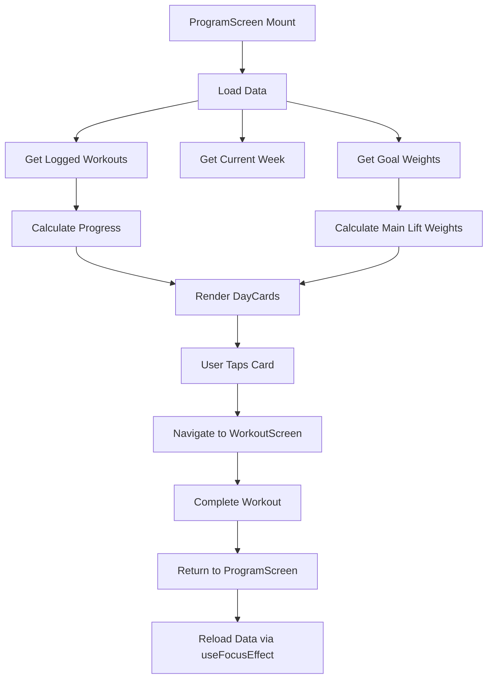

The **ProgramScreen** component is the primary interface for navigating the Rippler program. It displays a week selector and a list of workout days for the selected week, showing completion status and main lift targets.

## Overview

This screen serves as the hub for the entire training program, allowing users to:
- Select different weeks (1-12) in the program
- View all workout days for the selected week
- See completion progress for each workout
- Navigate to individual workout sessions
- View calculated main lift weights based on goal settings

Location: `~/workspace/source/client/screens/ProgramScreen.tsx`

## Key Features

<CardGroup cols={2}>
  <Card title="Week Navigation" icon="calendar">
    Interactive week selector for navigating all 12 weeks
  </Card>
  <Card title="Progress Tracking" icon="chart-line">
    Visual indicators showing completed sets for each workout
  </Card>
  <Card title="Pull to Refresh" icon="rotate">
    Refresh workout data and completion status
  </Card>
  <Card title="Main Lift Preview" icon="dumbbell">
    Display calculated weight for the primary lift of each day
  </Card>
</CardGroup>

## State Management

```typescript
const [selectedWeek, setSelectedWeek] = useState(1);
const [loggedWorkouts, setLoggedWorkouts] = useState<LoggedWorkout[]>([]);
const [goalWeights, setGoalWeights] = useState<Record<string, number>>({});
const [refreshing, setRefreshing] = useState(false);

const totalWeeks = Object.keys(ripplerProgram.weeks).length;
const weekWorkouts = ripplerProgram.weeks[String(selectedWeek)] || [];
```

### Data Loading

The screen loads multiple data sources in parallel:

```typescript
const loadData = async () => {
  const [logged, currentWeek, goals] = await Promise.all([
    getLoggedWorkouts(),
    getCurrentWeek(),
    getGoalWeights(),
  ]);
  setLoggedWorkouts(logged);
  setSelectedWeek(currentWeek);
  setGoalWeights(goals);
};
```

<Tabs>
  <Tab title="Initial Load">
    ```typescript
    useEffect(() => {
      loadData();
    }, []);
    ```
    
    Loads data when component mounts.
  </Tab>
  <Tab title="Focus Effect">
    ```typescript
    useFocusEffect(
      useCallback(() => {
        loadData();
      }, [])
    );
    ```
    
    Reloads data when screen gains focus (e.g., returning from WorkoutScreen).
  </Tab>
  <Tab title="Pull to Refresh">
    ```typescript
    const onRefresh = async () => {
      setRefreshing(true);
      await loadData();
      setRefreshing(false);
    };
    ```
    
    Manual refresh triggered by user gesture.
  </Tab>
</Tabs>

## Week Selection

```typescript
const handleWeekChange = async (week: number) => {
  setSelectedWeek(week);
  await setCurrentWeek(week);
};
```

The selected week is both stored in component state for immediate UI updates and persisted to storage for cross-session continuity.

<Note>
  The current week is saved to AsyncStorage, so users return to the same week when reopening the app.
</Note>

## Progress Calculation

Each workout's progress is calculated from logged data:

```typescript
const getWorkoutProgress = (workout: WorkoutDay) => {
  const logged = loggedWorkouts.find(
    (w) => w.week === workout.week && w.day === workout.day
  );
  if (!logged) return { isCompleted: false, completedSets: 0, totalSets: 0 };

  let completedSets = 0;
  let totalSets = 0;

  logged.exercises.forEach((ex) => {
    ex.sets.forEach((set) => {
      totalSets++;
      if (set.completed) completedSets++;
    });
  });

  return {
    isCompleted: logged.completed,
    completedSets,
    totalSets,
  };
};
```

<Info>
  Progress is calculated by counting completed sets vs total sets across all exercises in the workout.
</Info>

## Main Lift Weight Calculation

```typescript
const getMainLiftWeight = (workout: WorkoutDay): number | string | undefined => {
  const mainLift = workout.exercises.find((e) => e.tier === "T1");
  if (!mainLift) return undefined;

  const mainLiftIndex = workout.exercises.findIndex((e) => e.tier === "T1");
  const mergedGoals = { ...getDefaultGoals(), ...goalWeights };
  const calculatedWeight = calculateTargetWeight(
    mainLift.exercise,
    workout.week,
    workout.day,
    mainLiftIndex,
    mergedGoals
  );

  return calculatedWeight !== null ? calculatedWeight : mainLift.weight;
};
```

This function:
1. Finds the T1 (main) lift for the workout
2. Merges saved goal weights with defaults
3. Calculates the target weight based on the program's percentage scheme
4. Falls back to the static weight if calculation fails

## Navigation

```typescript
const handleDayPress = (workout: WorkoutDay) => {
  navigation.navigate("Workout", {
    week: workout.week,
    day: workout.day,
  });
};
```

Tapping a workout card navigates to the WorkoutScreen with week and day parameters.

## UI Structure

```tsx
<FlatList
  data={weekWorkouts}
  renderItem={renderItem}
  ListHeaderComponent={renderHeader}
  refreshControl={<RefreshControl refreshing={refreshing} onRefresh={onRefresh} />}
  contentContainerStyle={{
    paddingTop: headerHeight + Spacing.xl,
    paddingBottom: tabBarHeight + Spacing.xl,
    paddingHorizontal: Spacing.lg,
  }}
/>
```

### Header Component

```typescript
const renderHeader = () => (
  <View style={styles.headerContainer}>
    <ThemedText type="h1" style={styles.title}>
      The Rippler
    </ThemedText>
    <ThemedText style={[styles.subtitle, { color: theme.textSecondary }]}>
      12-Week Strength Program
    </ThemedText>
    <WeekSelector
      totalWeeks={totalWeeks}
      currentWeek={selectedWeek}
      onWeekChange={handleWeekChange}
    />
    <ThemedText type="h4" style={styles.weekTitle}>
      Week {selectedWeek}
    </ThemedText>
  </View>
);
```

### Day Card Rendering

```typescript
const renderItem = ({ item }: { item: WorkoutDay }) => {
  const progress = getWorkoutProgress(item);
  const mainLiftWeight = getMainLiftWeight(item);
  
  return (
    <DayCard
      workout={item}
      onPress={() => handleDayPress(item)}
      isCompleted={progress.isCompleted}
      completedSets={progress.completedSets}
      totalSets={progress.totalSets}
      mainLiftWeight={mainLiftWeight}
    />
  );
};
```

## Data Flow



## Component Integrations

<AccordionGroup>
  <Accordion title="WeekSelector Component">
    The WeekSelector provides a horizontal scrollable list of week numbers:
    
    ```tsx
    <WeekSelector
      totalWeeks={12}
      currentWeek={selectedWeek}
      onWeekChange={handleWeekChange}
    />
    ```
    
    Users can quickly jump to any week in the program.
  </Accordion>
  
  <Accordion title="DayCard Component">
    DayCard displays a workout day with all relevant information:
    
    ```tsx
    <DayCard
      workout={item}
      onPress={() => handleDayPress(item)}
      isCompleted={progress.isCompleted}
      completedSets={progress.completedSets}
      totalSets={progress.totalSets}
      mainLiftWeight={mainLiftWeight}
    />
    ```
    
    Shows:
    - Day name (e.g., "Upper A", "Lower B")
    - Exercise list preview
    - Progress indicator (X/Y sets completed)
    - Main lift target weight
    - Completion badge
  </Accordion>
  
  <Accordion title="Program Data Structure">
    The Rippler program data is structured by week and day:
    
    ```typescript
    // data/rippler-program.ts
    export const ripplerProgram = {
      weeks: {
        "1": [
          {
            week: 1,
            day: "Upper A",
            exercises: [
              { tier: "T1", exercise: "Bench Press", weight: 225, reps: 5, sets: 5 },
              { tier: "T2", exercise: "Close Grip Bench", weight: 180, reps: 8, sets: 3 },
              // ...
            ]
          },
          // ...
        ],
        "2": [ /* ... */ ],
        // ... weeks 3-12
      }
    };
    ```
  </Accordion>
</AccordionGroup>

## Layout Considerations

The screen uses navigation hooks for proper spacing around device UI elements:

```typescript
const insets = useSafeAreaInsets();
const headerHeight = useHeaderHeight();
const tabBarHeight = useBottomTabBarHeight();

contentContainerStyle={{
  paddingTop: headerHeight + Spacing.xl,
  paddingBottom: tabBarHeight + Spacing.xl,
  paddingHorizontal: Spacing.lg,
}}
scrollIndicatorInsets={{ bottom: insets.bottom }}
```

<Warning>
  Always account for header and tab bar heights to prevent content from being obscured by navigation elements.
</Warning>

## Performance Optimization

- **Parallel Data Loading**: Uses `Promise.all` to load multiple data sources simultaneously
- **FlatList**: Efficient rendering of workout days with built-in virtualization
- **Memoized Callbacks**: `useFocusEffect` with proper dependency arrays
- **Conditional Rendering**: Only calculates progress and weights for visible items

## User Experience Features

<Steps>
  <Step title="Auto-refresh on Focus">
    Data automatically refreshes when returning from WorkoutScreen, showing updated progress
  </Step>
  <Step title="Pull to Refresh">
    Manual refresh gesture for users who want to ensure data is up-to-date
  </Step>
  <Step title="Persistent Week Selection">
    Selected week persists across app sessions
  </Step>
  <Step title="Visual Progress Indicators">
    Clear visual feedback on workout completion status
  </Step>
  <Step title="Target Weight Display">
    Users see calculated main lift weights before starting workout
  </Step>
</Steps>

## Related Components

- [WorkoutScreen](/screens/workout-screen) - Individual workout execution screen
- [GoalsScreen](/screens/goals-screen) - Set goal weights used for calculations
- [WeekSelector](/components/week-selector) - Week navigation component
- [DayCard](/components/day-card) - Workout day display component