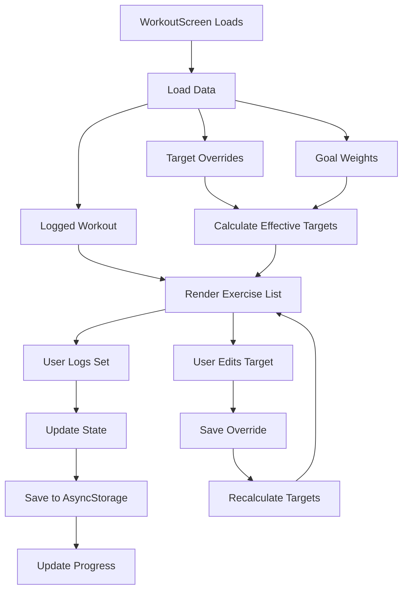

The **WorkoutScreen** component is where users perform and log their workouts. It displays exercises for a specific week and day, allows input of weight and reps for each set, tracks completion, and supports editing target weights.

## Overview

This is the most complex screen in the app, handling:
- Real-time set logging and completion tracking
- Dynamic target weight calculations based on goal weights
- Exercise-level expand/collapse for better UX
- Target override functionality (modify reps/sets/weight for specific exercises)
- Progress visualization
- Haptic feedback for user actions

Location: `~/workspace/source/client/screens/WorkoutScreen.tsx`

## Key Features

<CardGroup cols={2}>
  <Card title="Real-time Logging" icon="pen-to-square">
    Log weight and reps for each set with immediate save to storage
  </Card>
  <Card title="Target Overrides" icon="sliders">
    Modify target weight, reps, or sets for any exercise in the workout
  </Card>
  <Card title="Progress Tracking" icon="list-check">
    Visual progress bar and set completion indicators
  </Card>
  <Card title="Expandable Exercises" icon="chevron-down">
    Collapse completed exercises to focus on current work
  </Card>
</CardGroup>

## Route Parameters

```typescript
type WorkoutRouteProp = RouteProp<RootStackParamList, "Workout">;

const route = useRoute<WorkoutRouteProp>();
const { week, day } = route.params;

// Example: { week: 1, day: "Upper A" }
```

The screen receives week and day parameters from navigation, used to load the correct workout template.

## State Management

The screen maintains multiple pieces of state:

```typescript
const [loggedWorkout, setLoggedWorkout] = useState<LoggedWorkout | null>(null);
const [expandedExercise, setExpandedExercise] = useState<number | null>(0);
const [targetOverrides, setTargetOverrides] = useState<TargetOverride[]>([]);
const [goalWeights, setGoalWeights] = useState<Record<string, number>>({});

// Edit modal state
const [editModalVisible, setEditModalVisible] = useState(false);
const [editingExerciseIndex, setEditingExerciseIndex] = useState<number | null>(null);
const [editWeight, setEditWeight] = useState("");
const [editReps, setEditReps] = useState("");
const [editSets, setEditSets] = useState("");
```

### Data Loading

```typescript
const loadData = async () => {
  setDataLoaded(false);
  const [overrides, logged, goals] = await Promise.all([
    getTargetOverridesForDay(week, day),
    getLoggedWorkoutForDay(week, day),
    getGoalWeights(),
  ]);
  
  setTargetOverrides(overrides);
  setGoalWeights(goals);
  
  if (logged) {
    setLoggedWorkout(logged);
  } else {
    setLoggedWorkout(null);
  }
  setDataLoaded(true);
};
```

<Tabs>
  <Tab title="Initial Load">
    ```typescript
    useEffect(() => {
      loadData();
    }, [week, day]);
    ```
  </Tab>
  <Tab title="Focus Effect">
    ```typescript
    useFocusEffect(
      useCallback(() => {
        loadData();
      }, [week, day])
    );
    ```
  </Tab>
  <Tab title="Workout Initialization">
    ```typescript
    useEffect(() => {
      if (dataLoaded && !loggedWorkout && targetWorkout) {
        setLoggedWorkout(initializeLoggedWorkout());
      }
    }, [dataLoaded, targetWorkout]);
    ```
    
    Creates a new logged workout if none exists for this week/day.
  </Tab>
</Tabs>

## Target Weight Calculation

The `getEffectiveTarget` function combines multiple data sources:

```typescript
const getEffectiveTarget = useCallback((target: TargetExercise, index: number): EffectiveTarget => {
  const override = targetOverrides.find((o) => o.exerciseIndex === index);
  
  // Calculate base weight from goal weights
  let baseWeight = target.weight;
  const mergedGoals = { ...getDefaultGoals(), ...goalWeights };
  const calculatedWeight = calculateTargetWeight(
    target.exercise,
    week,
    day,
    index,
    mergedGoals
  );
  if (calculatedWeight !== null) {
    baseWeight = calculatedWeight;
  }

  // Apply overrides if they exist
  if (override) {
    return {
      ...target,
      weight: override.weight !== undefined ? override.weight : baseWeight,
      reps: override.reps !== undefined ? override.reps : target.reps,
      sets: override.sets !== undefined ? override.sets : target.sets,
      isModified: true,
    };
  }
  
  return { ...target, weight: baseWeight, isModified: false };
}, [targetOverrides, goalWeights, week, day]);
```

<Info>
  This function creates a three-tier priority system: overrides > calculated weights > default weights
</Info>

## Workout Initialization

```typescript
const initializeLoggedWorkout = useCallback((): LoggedWorkout => {
  return {
    id: `${week}-${day}`,
    week,
    day,
    dateLogged: new Date().toISOString(),
    exercises: targetWorkout.exercises.map((ex, index) => {
      const effective = getEffectiveTarget(ex, index);
      const totalSets = typeof effective.sets === "number"
        ? effective.sets
        : parseInt(String(effective.sets).replace("+", ""), 10);

      return {
        tier: ex.tier,
        exercise: ex.exercise,
        sets: Array.from({ length: totalSets }, (_, i) => ({
          setNumber: i + 1,
          weight: "",
          reps: "",
          completed: false,
        })),
      };
    }),
    completed: false,
  };
}, [week, day, targetWorkout, getEffectiveTarget]);
```

## Set Management

<Tabs>
  <Tab title="Toggle Completion">
    ```typescript
    const handleToggleSetComplete = async (exerciseIndex: number, setIndex: number) => {
      if (!loggedWorkout) return;

      const updated = { ...loggedWorkout };
      updated.exercises = [...updated.exercises];
      updated.exercises[exerciseIndex] = { ...updated.exercises[exerciseIndex] };
      updated.exercises[exerciseIndex].sets = [...updated.exercises[exerciseIndex].sets];
      
      updated.exercises[exerciseIndex].sets[setIndex] = {
        ...updated.exercises[exerciseIndex].sets[setIndex],
        completed: !updated.exercises[exerciseIndex].sets[setIndex].completed,
      };

      // Check if all sets are completed
      const allCompleted = updated.exercises.every((ex) =>
        ex.sets.every((s) => s.completed)
      );
      updated.completed = allCompleted;

      setLoggedWorkout(updated);
      await saveLoggedWorkout(updated);
    };
    ```
  </Tab>
  <Tab title="Update Weight">
    ```typescript
    const handleUpdateWeight = async (
      exerciseIndex: number,
      setIndex: number,
      weight: string
    ) => {
      if (!loggedWorkout) return;

      const updated = { ...loggedWorkout };
      updated.exercises[exerciseIndex].sets[setIndex].weight = weight;

      setLoggedWorkout(updated);
      await saveLoggedWorkout(updated);
    };
    ```
  </Tab>
  <Tab title="Update Reps">
    ```typescript
    const handleUpdateReps = async (
      exerciseIndex: number,
      setIndex: number,
      reps: string
    ) => {
      if (!loggedWorkout) return;

      const updated = { ...loggedWorkout };
      updated.exercises[exerciseIndex].sets[setIndex].reps = reps;

      setLoggedWorkout(updated);
      await saveLoggedWorkout(updated);
    };
    ```
  </Tab>
</Tabs>

<Warning>
  All updates are immediately saved to AsyncStorage to prevent data loss if the app crashes or is closed.
</Warning>

## Target Override System

Users can modify targets for individual exercises:

```typescript
const openEditModal = (index: number) => {
  if (!targetWorkout) return;
  
  const effective = getEffectiveTarget(targetWorkout.exercises[index], index);
  setEditingExerciseIndex(index);
  setEditWeight(String(effective.weight));
  setEditReps(String(effective.reps));
  setEditSets(String(effective.sets).replace("+", ""));
  setEditModalVisible(true);
};

const handleSaveTarget = async () => {
  if (editingExerciseIndex === null) return;

  const override: TargetOverride = {
    week,
    day,
    exerciseIndex: editingExerciseIndex,
    weight: editWeight,
    reps: editReps,
    sets: editSets,
  };

  await saveTargetOverride(override);
  
  // Update local state
  const updatedOverrides = [...targetOverrides];
  const existingIndex = updatedOverrides.findIndex(
    (o) => o.exerciseIndex === editingExerciseIndex
  );
  if (existingIndex !== -1) {
    updatedOverrides[existingIndex] = override;
  } else {
    updatedOverrides.push(override);
  }
  setTargetOverrides(updatedOverrides);

  // Adjust logged workout if set count changed
  if (loggedWorkout && targetWorkout) {
    const totalSets = parseInt(String(editSets).replace("+", ""), 10);
    const currentSets = loggedWorkout.exercises[editingExerciseIndex]?.sets.length || 0;
    
    if (totalSets !== currentSets) {
      const updated = { ...loggedWorkout };
      updated.exercises[editingExerciseIndex].sets = Array.from({ length: totalSets }, (_, i) => {
        const existingSet = loggedWorkout.exercises[editingExerciseIndex]?.sets[i];
        return existingSet || {
          setNumber: i + 1,
          weight: "",
          reps: "",
          completed: false,
        };
      });
      setLoggedWorkout(updated);
      await saveLoggedWorkout(updated);
    }
  }

  setEditModalVisible(false);
  Haptics.notificationAsync(Haptics.NotificationFeedbackType.Success);
};
```

<Note>
  When set count changes, the system preserves existing logged data and adds/removes sets as needed.
</Note>

## Exercise Rendering

```typescript
const renderExercise = (
  target: TargetExercise,
  logged: LoggedExercise | undefined,
  index: number
) => {
  const effective = getEffectiveTarget(target, index);
  const isExpanded = expandedExercise === index;
  const completedSets = logged?.sets.filter((s) => s.completed).length || 0;
  const totalSets = logged?.sets.length || 0;

  return (
    <View style={styles.exerciseCard}>
      {/* Header: Exercise name, tier badge, progress */}
      <Pressable
        onPress={() => setExpandedExercise(isExpanded ? null : index)}
        style={styles.exerciseHeader}
      >
        <View style={styles.exerciseInfo}>
          <TierBadge tier={target.tier} />
          <ThemedText type="h4">{target.exercise}</ThemedText>
        </View>
        <View style={styles.exerciseRight}>
          <View style={styles.progressBadge}>
            <ThemedText>{completedSets}/{totalSets}</ThemedText>
          </View>
          <Feather name={isExpanded ? "chevron-up" : "chevron-down"} />
        </View>
      </Pressable>

      {/* Target info with edit button */}
      <Pressable style={styles.targetInfo} onPress={() => openEditModal(index)}>
        <View style={styles.targetRow}>
          <ThemedText>
            Target: {effective.weight} lbs x {effective.reps} reps x {effective.sets} sets
          </ThemedText>
          <Feather name="edit-2" color={effective.isModified ? theme.primary : theme.textSecondary} />
        </View>
        {effective.isModified && (
          <ThemedText style={{ color: theme.primary }}>Modified</ThemedText>
        )}
      </Pressable>

      {/* Expanded: Set rows */}
      {isExpanded && logged && (
        <View style={styles.setsContainer}>
          {logged.sets.map((set, setIndex) => (
            <SetRow
              key={setIndex}
              setNumber={set.setNumber}
              targetWeight={effective.weight}
              targetReps={effective.reps}
              loggedSet={set}
              onToggleComplete={() => handleToggleSetComplete(index, setIndex)}
              onUpdateWeight={(weight) => handleUpdateWeight(index, setIndex, weight)}
              onUpdateReps={(reps) => handleUpdateReps(index, setIndex, reps)}
            />
          ))}
        </View>
      )}
    </View>
  );
};
```

## Progress Visualization

```typescript
const totalSets = loggedWorkout?.exercises.reduce(
  (acc, ex) => acc + ex.sets.length,
  0
) || 0;

const completedSets = loggedWorkout?.exercises.reduce(
  (acc, ex) => acc + ex.sets.filter((s) => s.completed).length,
  0
) || 0;

<View style={styles.progressCard}>
  <ThemedText>Overall Progress</ThemedText>
  <View style={styles.progressBar}>
    <View
      style={[
        styles.progressFill,
        {
          backgroundColor: theme.success,
          width: totalSets > 0 ? `${(completedSets / totalSets) * 100}%` : "0%",
        },
      ]}
    />
  </View>
  <ThemedText type="h4">
    {completedSets} / {totalSets} sets completed
  </ThemedText>
</View>
```

## Complete Workout

```typescript
const handleCompleteWorkout = async () => {
  if (!loggedWorkout) return;

  if (Platform.OS !== "web") {
    Haptics.notificationAsync(Haptics.NotificationFeedbackType.Success);
  }

  const updated = { ...loggedWorkout, completed: true };
  updated.exercises = updated.exercises.map((ex) => ({
    ...ex,
    sets: ex.sets.map((s) => ({ ...s, completed: true })),
  }));

  setLoggedWorkout(updated);
  await saveLoggedWorkout(updated);
  navigation.goBack();
};
```

<Info>
  Completing a workout marks all sets as completed and navigates back to ProgramScreen.
</Info>

## Edit Target Modal

```tsx
<Modal
  visible={editModalVisible}
  animationType="slide"
  transparent
  onRequestClose={() => setEditModalVisible(false)}
>
  <KeyboardAvoidingView 
    behavior={Platform.OS === "ios" ? "padding" : "height"}
    style={styles.modalOverlay}
  >
    <View style={styles.modalContent}>
      <View style={styles.modalHeader}>
        <ThemedText type="h3">Edit Target</ThemedText>
        <Pressable onPress={() => setEditModalVisible(false)}>
          <Feather name="x" size={24} />
        </Pressable>
      </View>

      <ThemedText style={styles.modalSubtitle}>
        {editingExerciseName}
      </ThemedText>

      <View style={styles.inputGroup}>
        <ThemedText>Weight (lbs or BW)</ThemedText>
        <TextInput
          value={editWeight}
          onChangeText={setEditWeight}
          placeholder="e.g., 135 or BW"
        />
      </View>

      <View style={styles.inputGroup}>
        <ThemedText>Reps (number or Max)</ThemedText>
        <TextInput
          value={editReps}
          onChangeText={setEditReps}
          placeholder="e.g., 5 or Max"
        />
      </View>

      <View style={styles.inputGroup}>
        <ThemedText>Sets</ThemedText>
        <TextInput
          value={editSets}
          onChangeText={setEditSets}
          keyboardType="number-pad"
          placeholder="e.g., 3"
        />
      </View>

      <View style={styles.modalButtons}>
        <Button variant="secondary" onPress={() => setEditModalVisible(false)}>
          Cancel
        </Button>
        <Button onPress={handleSaveTarget}>
          Save
        </Button>
      </View>
    </View>
  </KeyboardAvoidingView>
</Modal>
```

## Data Flow



## Performance Considerations

- **Immediate State Updates**: UI updates immediately, save happens asynchronously
- **Memoized Calculations**: `getEffectiveTarget` is memoized with useCallback
- **Expandable Exercises**: Only render set rows for expanded exercises
- **Parallel Data Loading**: Load overrides, logged data, and goals simultaneously

## Best Practices

<Steps>
  <Step title="Immutable Updates">
    Always create new objects when updating state to ensure React detects changes
  </Step>
  <Step title="Auto-save Everything">
    Save every change immediately to prevent data loss
  </Step>
  <Step title="Haptic Feedback">
    Provide tactile feedback for important actions (complete set, save override)
  </Step>
  <Step title="Preserve Data">
    When modifying set count, preserve existing logged data
  </Step>
  <Step title="Visual Feedback">
    Show "Modified" badge when targets have been overridden
  </Step>
</Steps>

## Related Components

- [SetRow](/components/set-row) - Individual set input and completion row
- [TierBadge](/components/tier-badge) - T1/T2/T3 visual indicator
- [ProgramScreen](/screens/program-screen) - Returns here after workout completion
- [GoalsScreen](/screens/goals-screen) - Source of goal weights for calculations